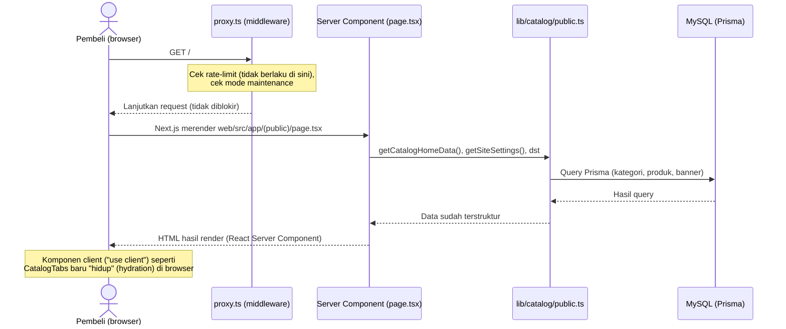
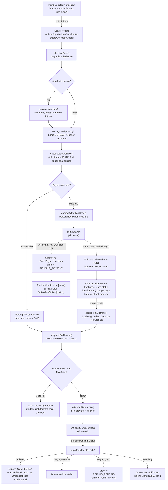
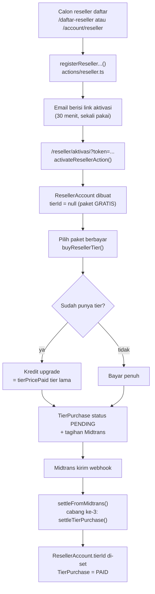
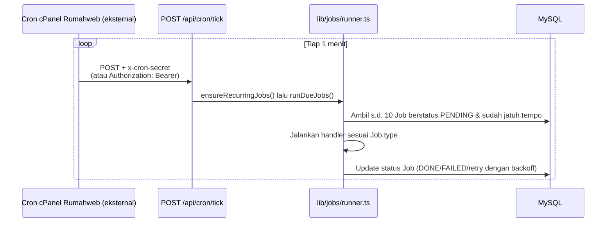

# 01 — Arsitektur

## 1. Peringatan Penting: Next.js 16 Berbeda dari yang Umum Dikenal

File `web/AGENTS.md` di repo ini secara eksplisit menulis:

> "This is NOT the Next.js you know — This version has breaking changes — APIs, conventions, and file structure may all differ from your training data. Read the relevant guide in `node_modules/next/dist/docs/` before writing any code."

Contoh nyata yang sudah kepakai di proyek ini:

- **`middleware.ts` sudah TIDAK DIPAKAI LAGI — namanya berubah jadi `proxy.ts`.** Dokumentasi resmi Next.js yang ter-bundle (`web/node_modules/next/dist/docs/01-app/03-api-reference/03-file-conventions/proxy.md`) bilang: *"The `middleware` file convention is deprecated and has been renamed to `proxy`."* Proyek ini memakai `web/src/proxy.ts` — kalau kamu (atau AI assistant lain) terbiasa mencari `middleware.ts`, file itu **tidak ada** di sini, dan memang seharusnya begitu.
- **Kalau ragu soal API/konvensi Next.js tertentu di versi ini, cek dulu isi `web/node_modules/next/dist/docs/`** sebelum mengasumsikan berdasar Next.js versi lama.

## 2. Diagram Alur Request — Belanja Storefront (Baca Katalog)



**Poin kunci:** untuk halaman storefront biasa, **tidak ada API route yang dipanggil sama sekali** — Server Component (`page.tsx`) langsung mengimpor fungsi dari `web/src/lib/` dan memanggil Prisma langsung di server, tanpa lewat HTTP internal. Ini beda dari arsitektur "frontend fetch ke backend API" yang umum di framework lain.

## 3. Diagram Alur Request — Checkout & Pembayaran



Tiga hal di diagram ini yang gampang salah diingat:

- **Stok ditahan sejak checkout**, bukan saat pembayaran berhasil. Menahannya belakangan berarti dua orang bisa memesan barang terakhir yang sama. Sisanya diturunkan dari **status order**, persis seperti kuota voucher — bukan dari sebuah counter, karena status berpindah ke gagal di banyak tempat dan counter yang lupa dikurangi bocor tanpa error.
- **Penjaga anti-jual-rugi mengadu modal dengan harga SETELAH voucher**, bukan sebelumnya. Uang yang benar-benar masuk adalah yang sesudah potongan; membandingkan harga sebelum voucher membuat penjaga itu bisa dilewati.
- **`Order.costPrice` diisi di dua waktu berbeda.** Produk `MANUAL`: saat checkout (modalnya sudah diketahui, dari `ProductItem.costPrice`). Produk `AUTO`: baru saat **fulfillment berhasil**, karena modal sesungguhnya adalah yang ditagihkan provider.

Penjelasan lengkap tiap langkah ada di `docs/04-INTEGRASI-PAYMENT-PPOB.md`.

## 3.1 Diagram Alur — Beli Paket Reseller

Alur uang **kedua** di aplikasi ini, sering terlupa karena bentuknya mirip checkout tapi tidak menghasilkan `Order` sama sekali.



Yang perlu diingat:

- **Paket GRATIS diwakili `tierId = null`, bukan sebuah baris `MembershipTier`.** Reseller gratis tetap punya `ResellerAccount`.
- **Tier bersifat LIFETIME** — tidak ada masa berlaku. Kolom `MembershipTier.durationDays` sudah usang dan sudah dihapus dari semua form.
- **Kredit upgrade dihitung dari `tierPricePaid`** (yang benar-benar dibayar), bukan dari harga tier saat ini — kalau tidak, menaikkan harga tier akan mengubah kredit orang yang sudah membeli.
- **`settleFromMidtrans()` punya 3 cabang**, dan ini satu-satunya tempat yang memutuskan: `Order` → `Deposit` → `TierPurchase`. Kalau menambah jenis pembayaran baru, di sinilah cabangnya bertambah.

## 4. Pemisahan "Frontend" vs "Backend" di Codebase Ini

Proyek ini **tidak** punya folder terpisah `frontend/` dan `backend/` seperti arsitektur client-server tradisional — semuanya satu aplikasi Next.js. Tapi secara konseptual, pemisahannya begini:

| Peran | Lokasi kode | Penjelasan |
|---|---|---|
| **"Frontend" (tampilan/UI)** | `web/src/app/(public)/`, `web/src/app/account/`, `web/src/components/` | Halaman & komponen yang dilihat pembeli. Sebagian Server Component (render di server, HTML jadi langsung), sebagian Client Component (`"use client"`, interaktif — form, dropdown, polling). |
| **"Frontend" panel admin** | `web/src/app/admin/` | Terpisah dari storefront (layout, styling, dan proteksi akses beda), tapi secara arsitektur pola yang sama: campuran Server Component + Client Component. |
| **"Frontend" portal mitra** | `web/src/app/mitra/` | Permukaan keempat: tempat mitra H2H melihat saldo, transaksi, kredensial, dan log callback-nya sendiri. |
| **"Backend" — Server Actions** | `web/src/app/actions/*.ts` | **Ini backend utama aplikasi ini** (30 berkas). Fungsi `async` bertanda `"use server"` yang dipanggil LANGSUNG dari form/komponen React (Next.js yang menangani serialisasi request/response-nya, developer tidak perlu bikin endpoint HTTP manual). Semua mutasi data (checkout, buat produk, dll.) lewat sini. |
| **"Backend" — API Routes** | `web/src/app/api/**/route.ts` | 17 berkas, dipakai HANYA untuk kebutuhan yang MEMANG butuh endpoint HTTP asli: (1) **webhook** dari pihak luar (Midtrans, Digiflazz, OkeConnect — tidak bisa "memanggil" Server Action), (2) **polling** status dari client component (`fetch()` lewat `@tanstack/react-query`), (3) **cron** dari luar (cPanel Rumahweb), (4) **API partner** `/api/v1/*` untuk sistem mitra, (5) **beacon** statistik kunjungan. Lihat `docs/03-BACKEND-API.md` untuk daftar lengkap. |
| **"Backend" — akses data** | `web/src/lib/` | Semua logic bisnis & akses Prisma. Server Actions dan API Routes sama-sama memanggil fungsi dari sini — ini lapisan yang sebenarnya "backend" dalam arti tradisional. |
| **Database** | `web/prisma/schema.prisma` | MySQL, diakses lewat Prisma Client (`web/src/lib/db.ts`). |

**Kenapa dua mekanisme backend (Server Action DAN API Route)?** Next.js App Router mendukung Server Action sebagai cara utama untuk mutasi data dari form — jadi kebanyakan "endpoint backend" proyek ini justru bukan URL yang bisa diketik di browser, melainkan fungsi yang di-import komponen client dan dipanggil seperti memanggil fungsi biasa. API Route (`route.ts`) dipakai HANYA kalau memang butuh URL HTTP asli yang bisa diakses pihak eksternal (webhook) atau lewat `fetch()` manual (polling).

## 5. Routing Next.js (App Router) di Proyek Ini

Proyek ini pakai **App Router** (folder `web/src/app/`), bukan Pages Router (`pages/`) — App Router itu sistem yang lebih baru di Next.js di mana **struktur folder = struktur URL**, dan tiap folder rute punya file `page.tsx` sebagai isinya.

### 5.1 Aturan dasar

| Konvensi file | Fungsi |
|---|---|
| `page.tsx` | Isi halaman untuk folder route tersebut. |
| `layout.tsx` | Bungkus SEMUA `page.tsx` di dalam folder itu (dan sub-foldernya) — dipakai untuk elemen yang berulang (header, footer). |
| `route.ts` | API Route Handler (bukan halaman) — mengembalikan response HTTP mentah, bukan JSX. |
| `[nama]/` | **Dynamic route** — segmen URL yang berubah-ubah, nilainya bisa dibaca lewat parameter `params`. |
| `(nama)/` | **Route group** — folder pengelompokan yang **TIDAK muncul di URL**, murni organisasi kode/berbagi layout. |

### 5.2 Contoh nyata dari proyek ini

**Route group:** `web/src/app/(public)/page.tsx` → URL-nya `/` (bukan `/public/`) — kurung `(public)` cuma dipakai supaya semua halaman storefront bisa berbagi satu `layout.tsx` (header + footer + tombol bantuan mengambang) tanpa mempengaruhi URL. Halaman lain seperti `/account`, `/invoice/[token]`, `/login` sengaja diletakkan **di luar** `(public)/` karena tidak memakai header/footer storefront itu.

**Dynamic route bersarang:** `web/src/app/(public)/[categorySlug]/[productSlug]/page.tsx` → URL `/[categorySlug]/[productSlug]` (mis. `/games/mobile-legends`). Dua level dynamic sekaligus — di dalam `page.tsx`-nya, nilai keduanya diambil lewat:
```tsx
export default async function ProductDetailPage({
  params,
}: {
  params: Promise<{ categorySlug: string; productSlug: string }>;
}) {
  const { categorySlug, productSlug } = await params;
  // ...
}
```
> **Catatan Next.js 16:** `params` di sini adalah **Promise** yang harus di-`await` — bukan objek langsung seperti di versi Next.js lama. Ini salah satu perubahan yang disinggung `web/AGENTS.md`.

**Dynamic route dengan token, bukan ID:** `web/src/app/invoice/[token]/page.tsx` → sengaja pakai `Order.publicToken` (cuid acak, tidak bisa ditebak) sebagai segmen URL, BUKAN `Order.orderNumber` (cuma 4 digit per hari, gampang ditebak) — ini keputusan keamanan, bukan kebetulan. Jangan pernah mengekspos `orderNumber` sebagai satu-satunya kunci akses ke data pesanan di URL publik.

**Query string, bukan dynamic route:** filter kategori di beranda pakai `?kategori=slug` (`web/src/app/(public)/catalog-tabs.tsx`), bukan `/kategori/[slug]` — karena semua kategori tampil di SATU halaman yang sama (tab switcher client-side), bukan halaman terpisah per kategori.

> Tab yang aktif **disinkronkan ke URL** setiap kali diganti. Dulu ia cuma hidup di `useState`, jadi refresh halaman selalu melempar orang kembali ke kategori pertama — termasuk saat dia sedang menelusuri kategori lain. Sinkronisasinya memakai **`history.replaceState`, bukan `router.replace()`**: keduanya mengubah URL, tapi `router.replace()` memicu Next.js merender ulang seluruh route di server hanya untuk menghasilkan halaman yang isinya identik — terasa berat tanpa satu pun informasi baru yang didapat.

### 5.3 Server Component vs Client Component

Default di App Router: **semua komponen adalah Server Component** (render di server, kode-nya tidak pernah dikirim ke browser, bisa langsung `await` Prisma). Komponen jadi Client Component (dikirim ke browser, bisa pakai `useState`/`onClick`/dll.) **hanya kalau** filenya diawali directive `"use client";` di baris pertama.

**Pola yang konsisten dipakai di proyek ini:** `page.tsx` (Server Component, fetch data) → merender satu komponen client (`"use client"`) yang menangani interaktivitas. Contoh: `web/src/app/(public)/[categorySlug]/[productSlug]/page.tsx` (Server, ambil data produk+harga dari DB) merender `ProductDetailClient` (Client, form checkout interaktif). Daftar lengkap pasangan ini ada di `docs/02-FRONTEND-STOREFRONT.md`.

### 5.4 `proxy.ts` — Middleware/Proxy

`web/src/proxy.ts` berjalan **sebelum** route mana pun dirender, untuk request yang cocok dengan `matcher` di bagian bawah file itu. Ini berkas paling penting untuk keamanan di seluruh proyek. Urutan eksekusinya persis seperti ini:

1. **Rate limiting** berbasis IP untuk endpoint sensitif (`/login`, `/register`, webhook, cron, polling status, `/api/v1/*`).
2. **Gerbang panel admin — tiga keputusan berturut-turut:**
   a. Boleh masuk panel sama sekali? (role `ADMIN` **atau** `STAFF`)
   b. Baris `User` dibaca **segar dari database** — cek `updatedAt` cocok dengan token (penegakan ban & pencabutan sesi) dan baca izin dari `StaffRole`.
   c. **Boleh buka halaman INI?** `canAccessAdminPath()` mencocokkan pathname dengan `ADMIN_ROUTE_RULES`. Yang ditolak **diantar** ke halaman pertama yang boleh dia buka, bukan disodori layar "akses ditolak".
3. **Gerbang `/account/*`** — cukup "sudah login".
4. **Gerbang `/mitra/*`** — juga cukup "sudah login". Apakah orang ini benar-benar mitra diperiksa di `app/mitra/layout.tsx`, yang bisa membedakan "bukan mitra" (diantar ke formulir pengajuan) dari "mitra nonaktif" (tetap boleh membaca portalnya). Middleware tidak punya konteks untuk membedakan itu tanpa query DB kedua.
5. **Mode maintenance** — halaman publik di-*rewrite* ke `/maintenance` (URL di address bar tidak berubah). Dikecualikan: `/admin`, `/mitra`, `/api`, `/login`, **aset PWA**, dan **jalur pemulihan akun**.
6. **2FA wajib** — siapa pun yang boleh masuk panel (termasuk STAFF) dialihkan ke `/admin/keamanan` sampai 2FA-nya terpasang.

Tiga hal yang wajib diingat tentang berkas ini:

> 🔴 **Penegakan berbasis route HARUS di sini, bukan di `layout.tsx`.** Layout Next.js **tidak dijalankan ulang** saat berpindah halaman dari dalam aplikasi — hanya saat halaman dimuat penuh. Gerbang di layout menyala tidak konsisten dan sudah pernah mengunci admin dari produksi. Middleware jalan di setiap request dan `nextUrl.pathname` selalu ada.

> ⚠️ **Peran & izin TIDAK dibaca dari token.** JWT di sini stateless dan berumur panjang, jadi token yang terbit sebelum izinnya dicabut akan terus membawa izin lama sampai kedaluwarsa. Pencabutan hak harus berlaku pada request berikutnya, bukan 12 jam lagi.

> ⚠️ **Dua pengecualian aset PWA yang bukan kelonggaran, melainkan syarat teknis.** `/admin/app.webmanifest` dilewatkan tanpa autentikasi karena browser mengambil manifest dengan `credentials: "omit"` — cookie sesi tidak ikut terkirim, seberapa pun sahnya admin yang membuka. Dan aset PWA dikecualikan dari maintenance karena *rewrite* membalas HTTP 200 berisi HTML: manifest yang jadi HTML membuat app yang **sudah terpasang di HP orang** kehilangan nama & ikonnya secara permanen.

Detail lengkap tiap aturan: `docs/03-BACKEND-API.md` §2.3 (rate limit) dan §5 (autentikasi & RBAC).

## 6. Job Background & Cron — Bukan Bagian dari Alur Request Biasa

Selain alur request-response biasa, ada satu jalur ketiga: **job queue** (tabel `Job` di database + `web/src/lib/jobs/runner.ts`). Ini dipakai untuk pekerjaan yang harus jalan **tanpa** ada pengguna yang sedang membuka halaman — misalnya mengecek ulang status transaksi provider, meng-expire pesanan yang tidak dibayar, sinkronisasi harga.



Job **tidak** jalan otomatis sendiri di Vercel — semuanya dipicu lewat panggilan eksternal ke `/api/cron/tick`, yang di produksi dijadwalkan dari **cron cPanel Rumahweb** (server yang sama dengan relay PHP ber-IP tetap; lihat `docs/08-IP-TETAP-DIGIFLAZZ.md`). Kalau endpoint ini berhenti dipanggil, pesanan tidak akan pernah auto-expire, sinkronisasi harga berhenti, status transaksi pending tidak pernah dicek ulang, dst. Lihat `docs/06-TROUBLESHOOTING-DEPLOY.md` untuk setup cron di production.

Gerbangnya (`isAuthorizedCron`) menerima **dua bentuk header**: `x-cron-secret: <CRON_SECRET>` dan `Authorization: Bearer <CRON_SECRET>`. Yang kedua ada supaya Vercel Cron tetap bisa dipakai tanpa mengubah kode kalau suatu saat dibutuhkan — Vercel hanya mengirim bentuk `Bearer`.

---

## Cheat Sheet — Arsitektur

| Saya mau tahu... | Jawaban singkat |
|---|---|
| File middleware ada di mana? | `web/src/proxy.ts` (BUKAN `middleware.ts` — nama itu sudah tidak dipakai lagi di Next.js versi ini) |
| Ini App Router atau Pages Router? | **App Router** (folder `web/src/app/`) |
| Di mana logic "backend" sebenarnya? | `web/src/app/actions/*.ts` (Server Actions) untuk mutasi via form; `web/src/app/api/**/route.ts` cuma untuk webhook/polling/cron |
| Kenapa ada folder `(public)` dengan tanda kurung? | Route group — pengelompokan kode, tidak muncul di URL |
| Kenapa `params` harus di-`await`? | Perubahan Next.js 16 — `params` sekarang berupa Promise |
| Kapan komponen jadi interaktif (client-side)? | Kalau ada `"use client";` di baris pertama file-nya |
| Job background dipicu dari mana? | `POST /api/cron/tick`, dipanggil cron eksternal (**cPanel Rumahweb**), bukan cron bawaan Vercel |
| Ada berapa "permukaan" aplikasi? | **Empat**: storefront `/`, akun pembeli `/account`, panel admin `/admin`, portal mitra `/mitra` |
| Di mana keputusan "siapa boleh buka halaman admin mana"? | `web/src/lib/rbac/access.ts` → `ADMIN_ROUTE_RULES`. Satu tabel, dipakai `proxy.ts` **dan** sidebar |
| Ada berapa alur uang? | **Dua**: checkout produk (§3) dan beli paket reseller (§3.1). Keduanya bertemu di `settleFromMidtrans()` |
| Kenapa gerbang akses ada di `proxy.ts` dan bukan di layout? | Layout tidak dijalankan ulang antar-navigasi di dalam app — gerbang di sana menyala tidak konsisten dan sudah pernah mengunci admin di produksi |
