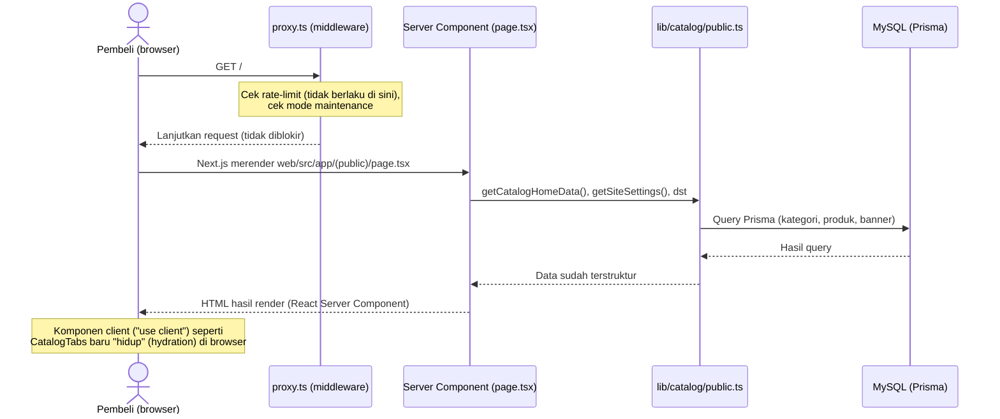
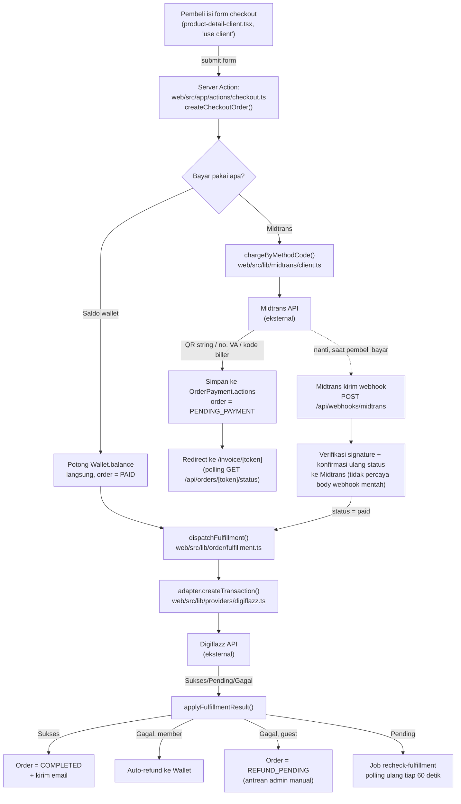
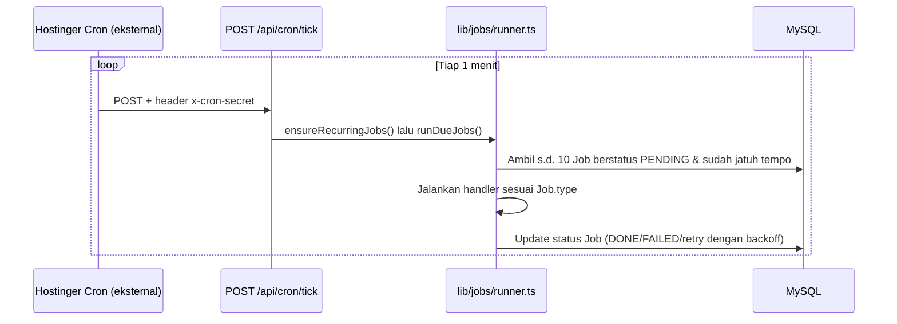

# 01 — Arsitektur

## 1. Peringatan Penting: Next.js 16 Berbeda dari yang Umum Dikenal

File `web/AGENTS.md` di repo ini secara eksplisit menulis:

> "This is NOT the Next.js you know — This version has breaking changes — APIs, conventions, and file structure may all differ from your training data. Read the relevant guide in `node_modules/next/dist/docs/` before writing any code."

Contoh nyata yang sudah kepakai di proyek ini:

- **`middleware.ts` sudah TIDAK DIPAKAI LAGI — namanya berubah jadi `proxy.ts`.** Dokumentasi resmi Next.js yang ter-bundle (`web/node_modules/next/dist/docs/01-app/03-api-reference/03-file-conventions/proxy.md`) bilang: *"The `middleware` file convention is deprecated and has been renamed to `proxy`."* Proyek ini memakai `web/src/proxy.ts` — kalau kamu (atau AI assistant lain) terbiasa mencari `middleware.ts`, file itu **tidak ada** di sini, dan memang seharusnya begitu.
- **Kalau ragu soal API/konvensi Next.js tertentu di versi ini, cek dulu isi `web/node_modules/next/dist/docs/`** sebelum mengasumsikan berdasar Next.js versi lama.

## 2. Diagram Alur Request — Belanja Storefront (Baca Katalog)



**Poin kunci:** untuk halaman storefront biasa, **tidak ada API route yang dipanggil sama sekali** — Server Component (`page.tsx`) langsung mengimpor fungsi dari `web/src/lib/` dan memanggil Prisma langsung di server, tanpa lewat HTTP internal. Ini beda dari arsitektur "frontend fetch ke backend API" yang umum di framework lain.

## 3. Diagram Alur Request — Checkout & Pembayaran



Penjelasan lengkap tiap langkah ada di `docs/04-INTEGRASI-PAYMENT-PPOB.md`.

## 4. Pemisahan "Frontend" vs "Backend" di Codebase Ini

Proyek ini **tidak** punya folder terpisah `frontend/` dan `backend/` seperti arsitektur client-server tradisional — semuanya satu aplikasi Next.js. Tapi secara konseptual, pemisahannya begini:

| Peran | Lokasi kode | Penjelasan |
|---|---|---|
| **"Frontend" (tampilan/UI)** | `web/src/app/(public)/`, `web/src/app/account/`, `web/src/components/` | Halaman & komponen yang dilihat pembeli. Sebagian Server Component (render di server, HTML jadi langsung), sebagian Client Component (`"use client"`, interaktif — form, dropdown, polling). |
| **"Frontend" panel admin** | `web/src/app/admin/` | Terpisah dari storefront (layout, styling, dan proteksi akses beda), tapi secara arsitektur pola yang sama: campuran Server Component + Client Component. |
| **"Backend" — Server Actions** | `web/src/app/actions/*.ts` | **Ini backend utama aplikasi ini.** Fungsi `async` bertanda `"use server"` yang dipanggil LANGSUNG dari form/komponen React (Next.js yang menangani serialisasi request/response-nya, developer tidak perlu bikin endpoint HTTP manual). Semua mutasi data (checkout, buat produk, dll.) lewat sini. |
| **"Backend" — API Routes** | `web/src/app/api/**/route.ts` | Cuma dipakai untuk 3 kebutuhan spesifik yang MEMANG butuh endpoint HTTP asli: (1) **webhook** dari pihak luar (Midtrans, tidak bisa "memanggil" Server Action), (2) **polling** status dari client component (`fetch()` biasa lewat `@tanstack/react-query`), (3) **cron** dari luar (Hostinger). Lihat `docs/03-BACKEND-API.md` untuk daftar lengkap. |
| **"Backend" — akses data** | `web/src/lib/` | Semua logic bisnis & akses Prisma. Server Actions dan API Routes sama-sama memanggil fungsi dari sini — ini lapisan yang sebenarnya "backend" dalam arti tradisional. |
| **Database** | `web/prisma/schema.prisma` | MySQL, diakses lewat Prisma Client (`web/src/lib/db.ts`). |

**Kenapa dua mekanisme backend (Server Action DAN API Route)?** Next.js App Router mendukung Server Action sebagai cara utama untuk mutasi data dari form — jadi kebanyakan "endpoint backend" proyek ini justru bukan URL yang bisa diketik di browser, melainkan fungsi yang di-import komponen client dan dipanggil seperti memanggil fungsi biasa. API Route (`route.ts`) dipakai HANYA kalau memang butuh URL HTTP asli yang bisa diakses pihak eksternal (webhook) atau lewat `fetch()` manual (polling).

## 5. Routing Next.js (App Router) di Proyek Ini

Proyek ini pakai **App Router** (folder `web/src/app/`), bukan Pages Router (`pages/`) — App Router itu sistem yang lebih baru di Next.js di mana **struktur folder = struktur URL**, dan tiap folder rute punya file `page.tsx` sebagai isinya.

### 5.1 Aturan dasar

| Konvensi file | Fungsi |
|---|---|
| `page.tsx` | Isi halaman untuk folder route tersebut. |
| `layout.tsx` | Bungkus SEMUA `page.tsx` di dalam folder itu (dan sub-foldernya) — dipakai untuk elemen yang berulang (header, footer). |
| `route.ts` | API Route Handler (bukan halaman) — mengembalikan response HTTP mentah, bukan JSX. |
| `[nama]/` | **Dynamic route** — segmen URL yang berubah-ubah, nilainya bisa dibaca lewat parameter `params`. |
| `(nama)/` | **Route group** — folder pengelompokan yang **TIDAK muncul di URL**, murni organisasi kode/berbagi layout. |

### 5.2 Contoh nyata dari proyek ini

**Route group:** `web/src/app/(public)/page.tsx` → URL-nya `/` (bukan `/public/`) — kurung `(public)` cuma dipakai supaya semua halaman storefront bisa berbagi satu `layout.tsx` (header + footer + tombol bantuan mengambang) tanpa mempengaruhi URL. Halaman lain seperti `/account`, `/invoice/[token]`, `/login` sengaja diletakkan **di luar** `(public)/` karena tidak memakai header/footer storefront itu.

**Dynamic route bersarang:** `web/src/app/(public)/[categorySlug]/[productSlug]/page.tsx` → URL `/[categorySlug]/[productSlug]` (mis. `/games/mobile-legends`). Dua level dynamic sekaligus — di dalam `page.tsx`-nya, nilai keduanya diambil lewat:
```tsx
export default async function ProductDetailPage({
  params,
}: {
  params: Promise<{ categorySlug: string; productSlug: string }>;
}) {
  const { categorySlug, productSlug } = await params;
  // ...
}
```
> **Catatan Next.js 16:** `params` di sini adalah **Promise** yang harus di-`await` — bukan objek langsung seperti di versi Next.js lama. Ini salah satu perubahan yang disinggung `web/AGENTS.md`.

**Dynamic route dengan token, bukan ID:** `web/src/app/invoice/[token]/page.tsx` → sengaja pakai `Order.publicToken` (cuid acak, tidak bisa ditebak) sebagai segmen URL, BUKAN `Order.orderNumber` (cuma 4 digit per hari, gampang ditebak) — ini keputusan keamanan, bukan kebetulan. Jangan pernah mengekspos `orderNumber` sebagai satu-satunya kunci akses ke data pesanan di URL publik.

**Query string, bukan dynamic route:** filter kategori di beranda pakai `?kategori=slug` (`web/src/app/(public)/catalog-tabs.tsx`), bukan `/kategori/[slug]` — karena semua kategori tampil di SATU halaman yang sama (tab switcher client-side), bukan halaman terpisah per kategori.

### 5.3 Server Component vs Client Component

Default di App Router: **semua komponen adalah Server Component** (render di server, kode-nya tidak pernah dikirim ke browser, bisa langsung `await` Prisma). Komponen jadi Client Component (dikirim ke browser, bisa pakai `useState`/`onClick`/dll.) **hanya kalau** filenya diawali directive `"use client";` di baris pertama.

**Pola yang konsisten dipakai di proyek ini:** `page.tsx` (Server Component, fetch data) → merender satu komponen client (`"use client"`) yang menangani interaktivitas. Contoh: `web/src/app/(public)/[categorySlug]/[productSlug]/page.tsx` (Server, ambil data produk+harga dari DB) merender `ProductDetailClient` (Client, form checkout interaktif). Daftar lengkap pasangan ini ada di `docs/02-FRONTEND-STOREFRONT.md`.

### 5.4 `proxy.ts` — Middleware/Proxy

`web/src/proxy.ts` berjalan **sebelum** route mana pun dirender, untuk request yang cocok dengan `matcher` di bagian bawah file itu. Di proyek ini dipakai untuk 3 hal (urutan eksekusi persis seperti ini):

1. **Rate limiting** berbasis IP untuk beberapa endpoint sensitif (`/login`, `/register`, webhook, cron, polling status).
2. **Proteksi akses**: `/admin/*` wajib role `ADMIN` (dicek dari session DAN re-cek langsung ke database, bukan cuma percaya token session — supaya admin yang di-nonaktifkan tidak bisa terus pakai session lama), `/account/*` wajib login.
3. **Mode maintenance**: kalau admin mengaktifkan mode maintenance (`/admin/settings`), SEMUA halaman publik (kecuali `/admin`, `/api`, `/login`) di-rewrite ke `/maintenance` secara transparan (URL di address bar tidak berubah).

Detail lengkap tiap aturan: `docs/03-BACKEND-API.md` §4.

## 6. Job Background & Cron — Bukan Bagian dari Alur Request Biasa

Selain alur request-response biasa, ada satu jalur ketiga: **job queue** (tabel `Job` di database + `web/src/lib/jobs/runner.ts`). Ini dipakai untuk pekerjaan yang harus jalan **tanpa** ada pengguna yang sedang membuka halaman — misalnya mengecek ulang status transaksi provider, meng-expire pesanan yang tidak dibayar, sinkronisasi harga.



Job **tidak** jalan otomatis sendiri di Vercel (Vercel tidak menyediakan cron yang dipakai proyek ini) — semuanya dipicu lewat panggilan eksternal ke `/api/cron/tick`. Kalau endpoint ini berhenti dipanggil (mis. cron eksternal mati), pesanan tidak akan pernah auto-expire, sinkronisasi harga berhenti, dst. Lihat `docs/06-TROUBLESHOOTING-DEPLOY.md` untuk setup cron di production.

---

## Cheat Sheet — Arsitektur

| Saya mau tahu... | Jawaban singkat |
|---|---|
| File middleware ada di mana? | `web/src/proxy.ts` (BUKAN `middleware.ts` — nama itu sudah tidak dipakai lagi di Next.js versi ini) |
| Ini App Router atau Pages Router? | **App Router** (folder `web/src/app/`) |
| Di mana logic "backend" sebenarnya? | `web/src/app/actions/*.ts` (Server Actions) untuk mutasi via form; `web/src/app/api/**/route.ts` cuma untuk webhook/polling/cron |
| Kenapa ada folder `(public)` dengan tanda kurung? | Route group — pengelompokan kode, tidak muncul di URL |
| Kenapa `params` harus di-`await`? | Perubahan Next.js 16 — `params` sekarang berupa Promise |
| Kapan komponen jadi interaktif (client-side)? | Kalau ada `"use client";` di baris pertama file-nya |
| Job background dipicu dari mana? | `POST /api/cron/tick`, dipanggil cron eksternal (Hostinger), bukan cron bawaan Vercel |
