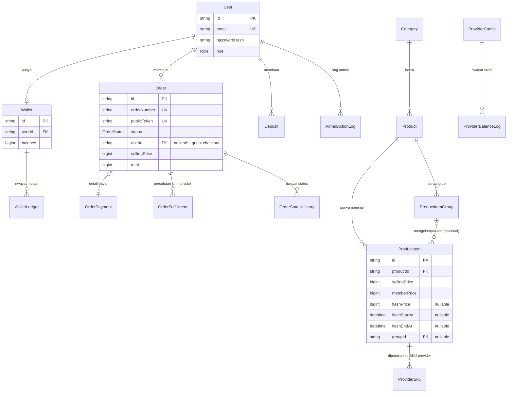

# 03 — Backend & API

## 1. Dua Jenis "Backend" di Proyek Ini

Baca dulu `docs/01-ARSITEKTUR.md` §4 kalau belum — proyek ini punya **Server Actions** (backend utama, dipanggil langsung dari form) dan **API Routes** (dipakai HANYA untuk webhook/polling/cron). Dokumen ini mencakup keduanya.

## 2. API Route Handlers (`web/src/app/api/**/route.ts`)

Semua route ini menerima/mengembalikan HTTP biasa (bisa dites lewat `curl`).

| Method | URL | File | Fungsi | Proteksi |
|---|---|---|---|---|
| GET, POST | `/api/auth/[...nextauth]` | `web/src/app/api/auth/[...nextauth]/route.ts` | Handler bawaan NextAuth — melayani `/api/auth/signin`, `/api/auth/callback/credentials`, `/api/auth/session`, `/api/auth/signout`, dll. | Ditangani penuh oleh NextAuth internal. |
| POST | `/api/cron/tick` | `web/src/app/api/cron/tick/route.ts` | Dipanggil cron eksternal tiap menit — menjalankan job yang sudah jatuh tempo (lihat `docs/01-ARSITEKTUR.md` §6). | Header `x-cron-secret` harus cocok `CRON_SECRET` (dibandingkan pakai `safeCompare`, timing-safe). |
| GET | `/api/admin/provider-price-list` | `web/src/app/api/admin/provider-price-list/route.ts` | Cari SKU di cache lokal harga provider (dipakai UI pemetaan SKU admin), query params `provider`, `q`. | Wajib login + role `ADMIN`, plus re-cek fresh ke database. |
| GET | `/api/deposits/[depositId]/status` | `web/src/app/api/deposits/[depositId]/status/route.ts` | Polling status pembayaran deposit. Return `{ depositId, status, amount, fee, uniqueCode, totalPaid, payment, expiredAt }`. | Wajib login; deposit harus milik `session.user.id`. |
| GET | `/api/orders/[token]/status` | `web/src/app/api/orders/[token]/status/route.ts` | Polling status pesanan. Return `{ orderNumber, status, productName, itemName, sellingPrice, fee, uniqueCode, total, payment, expiredAt, sn }`. `force-dynamic`. | **Tidak perlu login** — akses dijaga murni lewat kepemilikan `publicToken` (cuid acak) di URL. |
| GET | `/api/search` | `web/src/app/api/search/route.ts` | Pencarian produk storefront. Return `{ results }`. | Publik, tanpa proteksi. |
| POST | `/api/webhooks/midtrans` | `web/src/app/api/webhooks/midtrans/route.ts` | Notifikasi status pembayaran dari Midtrans. Lihat `docs/04-INTEGRASI-PAYMENT-PPOB.md` §2.6 untuk alur lengkap. | Body dibatasi 16.000 byte; signature diverifikasi (`verifyMidtransSignature`) SEBELUM sentuh database; idempotent lewat `WebhookEvent.eventKey`. |
| POST | `/api/webhooks/digiflazz` | `web/src/app/api/webhooks/digiflazz/route.ts` | Notifikasi status pengiriman produk dari Digiflazz (pelengkap job polling, opsional). Lihat `docs/04-INTEGRASI-PAYMENT-PPOB.md` §3.7. | Sama polanya dengan webhook Midtrans (verifikasi signature dulu, idempotent). **Menolak semua request kalau `webhookSecret` belum dikonfigurasi admin** (fail-closed). |

Route `/login` (POST), `/register` (POST), `/api/webhooks/midtrans`, `/api/cron/tick`, dan `/api/orders/[token]/status` juga di-rate-limit berbasis IP lewat `web/src/proxy.ts` sebelum sampai ke route handler-nya — lihat `docs/01-ARSITEKTUR.md` §5.4.

## 3. Server Actions (`web/src/app/actions/*.ts`)

Ini fungsi `"use server"` yang dipanggil langsung dari komponen React (biasanya lewat atribut `action={...}` pada `<form>`), **bukan** URL yang bisa diakses lewat `curl`. Dikelompokkan per file:

| File | Fungsi yang di-export | Untuk apa |
|---|---|---|
| `auth.ts` | `loginAction`, `registerAction`, `logoutAction` | Login/registrasi/logout. |
| `checkout.ts` | `createCheckoutOrder` | **Entry point checkout** — lihat `docs/04` §4 untuk alur lengkap. |
| `deposit.ts` | `createDeposit` | Isi saldo wallet. |
| `order-lookup.ts` | `lookupOrder` | "Cek Transaksi" — cari order tanpa login (email + nomor order). |
| `orders.ts` (admin) | `retryFulfillmentAction`, `retryRefundAction`, `markCompletedManualAction`, `markRefundedAction` | Admin menangani pesanan bermasalah. |
| `catalog.ts` (admin) | `uploadProductBanner`, `createProduct`, `updateProduct`, `toggleProductActive`, `createProductItem`, `updateProductItem`, `createProductItemGroup`, `updateProductItemGroup`, `deleteProductItemGroup`, `previewBulkMarkup`, `applyBulkMarkup`, `mapProviderSku`, `unmapProviderSku`, `bulkImportProducts` | Kelola produk, item/harga, grup item, markup massal, pemetaan SKU, import massal. |
| `categories.ts` (admin) | `createCategory`, `updateCategory`, `deleteCategory` | Kelola kategori. |
| `banners.ts` (admin) | `uploadBannerImage`, `createBanner`, `updateBanner`, `deleteBanner` | Kelola banner carousel. |
| `payment-methods.ts` (admin) | `uploadPaymentMethodLogo`, `updatePaymentMethod` | Kelola metode pembayaran (fee, logo, aktif/nonaktif). |
| `providers.ts` (admin) | `saveDigiflazzCredentials`, `toggleProviderActive`, `checkProviderBalance`, `sendTestTransaction`, `syncProviderNow`, `saveBalanceThreshold` | Kelola provider PPOB. |
| `settings.ts` (admin) | `saveLogo`, `uploadLogoFile`, `saveTrendingMode`, `saveFavicon`, `uploadFaviconFile`, `saveFaqItems`, `saveTosContent`, `savePrivacyContent`, `saveContactSettings`, `saveEmailConfig`, `saveMaintenanceMode` | Semua pengaturan situs (`/admin/settings`). |

**Pola proteksi admin yang konsisten di SEMUA action bertanda "(admin)" di atas:** tiap file punya fungsi lokal `requireAdmin()` (sengaja diduplikasi tiap file, bukan diimpor dari satu tempat — lihat komentar di kode aslinya, alasannya teknis: file dengan `"use server"` di level file cuma boleh meng-export async function) yang: (1) cek session dan `role === "ADMIN"`, (2) **re-cek ke database** apakah role & `updatedAt` user itu masih cocok dengan yang ada di session (jaga-jaga kalau admin baru saja di-nonaktifkan tapi sesi lamanya belum expired). Sebagian besar action admin juga memanggil `logAdmin()` untuk mencatat jejak aksi ke tabel `AdminActionLog`.

## 4. Autentikasi & Otorisasi

### 4.1 Cara login bekerja

File: `web/src/lib/auth.ts` + `web/src/lib/auth.config.ts`. Pakai **NextAuth v5 (Auth.js)**, provider **`Credentials`** (email+password) — bukan Google/OAuth/dll.

```ts
// web/src/lib/auth.ts (disederhanakan)
Credentials({
  credentials: { email: {}, password: {} },
  async authorize(credentials) {
    const parsed = loginSchema.safeParse(credentials);
    if (!parsed.success) return null;
    const user = await db.user.findUnique({ where: { email: parsed.data.email } });
    if (!user) return null;
    const ok = await verifyPassword(parsed.data.password, user.passwordHash);
    if (!ok) return null;
    return { id: user.id, email: user.email, name: user.name, role: user.role, updatedAt: user.updatedAt.getTime() };
  },
}),
```

Password di-hash pakai `bcryptjs` (lihat `web/src/lib/password.ts`), **tidak pernah** disimpan/dibandingkan sebagai teks biasa.

### 4.2 Session

`web/src/lib/auth.config.ts`:
```ts
session: { strategy: "jwt", maxAge: 8 * 60 * 60 }, // 8 jam
```
Session disimpan sebagai **JWT** (bukan session table di database) — `role` dan `updatedAt` user disisipkan ke dalam token lewat callback `jwt()`/`session()`, supaya bisa dibaca cepat tanpa query database di setiap request. **Tapi** untuk aksi sensitif (akses `/admin`, semua server action admin), kode **selalu** re-verifikasi field itu langsung ke database (lihat §3) — token JWT sendiri TIDAK pernah dipercaya 100% untuk keputusan otorisasi admin, karena JWT yang sudah diterbitkan tidak otomatis "tahu" kalau role user diubah admin lain setelah token itu dibuat.

### 4.3 Role-based access

Ada 2 role: `USER` (member biasa) dan `ADMIN` (`enum Role` di `web/prisma/schema.prisma`). Lapisan proteksinya (dari terluar ke terdalam):

1. **`web/src/proxy.ts`** — blokir akses ke `/admin/*` (bukan `ADMIN`→redirect `/login`) dan `/account/*` (belum login→redirect `/login`) SEBELUM halaman dirender sama sekali.
2. **`web/src/app/admin/layout.tsx`** — cek ulang role admin di level layout (lapis kedua, jaga-jaga).
3. **Tiap server action admin** — `requireAdmin()` lokal per file (§3), lapis ketiga, paling dekat dengan aksi mutasi data yang sesungguhnya.

### 4.4 Halaman yang butuh login vs tidak

| Kategori | Contoh halaman |
|---|---|
| Publik penuh (tanpa login) | `/`, `/[kategori]/[produk]`, `/faq`, `/kontak`, `/cek-transaksi`, `/invoice/[token]` (akses via token, bukan login) |
| Wajib login (member) | `/account/*` |
| Wajib login + role ADMIN | `/admin/*` |

## 5. Struktur Database — ERD

Sumber kebenaran: `web/prisma/schema.prisma`. Diagram di bawah mencakup model-model yang **punya relasi** satu sama lain (cluster inti bisnis). Model operasional tanpa relasi FK (log, cache, antrean job) didaftar terpisah di §5.2.



### 5.1 Penjelasan relasi penting

- **`Order.userId` bersifat opsional (`String?`)** — order BOLEH tidak terkait ke `User` sama sekali (checkout tamu/guest). Ini keputusan desain inti, bukan bug: jangan mengasumsikan `order.userId` selalu ada di kode baru.
- **`ProductItem.groupId` opsional + `onDelete: SetNull`** — hapus `ProductItemGroup` TIDAK menghapus item-item di dalamnya, cuma melepas relasinya (item jadi "tanpa grup").
- **`ProviderSku`** unique per `[productItemId, provider]` — satu nominal produk cuma boleh punya SATU pemetaan aktif per provider.

### 5.2 Model operasional (tanpa relasi FK ke model lain)

| Model | Fungsi |
|---|---|
| `Banner` | Banner carousel beranda. |
| `SiteSetting` | Key-value store semua pengaturan situs (logo, favicon, FAQ, dll.) — lihat `docs/05-CARA-TAMBAH-FITUR.md` kalau mau menambah pengaturan baru. |
| `PaymentMethodConfig` | Konfigurasi metode pembayaran (fee, logo, aktif/nonaktif) — dihubungkan ke order lewat kolom `code` (string), bukan relasi Prisma. |
| `ProviderPriceListCache` | Cache lokal seluruh daftar harga provider (untuk pencarian cepat di UI admin). |
| `PriceSyncLog` | Log riwayat sinkronisasi harga. |
| `Job` | Antrean job background (lihat `docs/01-ARSITEKTUR.md` §6). |
| `RateLimit` | Penyimpanan counter rate-limiting (dibersihkan berkala oleh job `cleanup-rate-limits`). |
| `WebhookEvent` | Log semua webhook masuk (dari Midtrans; kolom `source` juga menyiapkan ruang untuk provider PPOB lain di masa depan) — bisa dilihat di `/admin/webhooks`. |

## 6. Enum Penting

| Enum | Nilai | Dipakai di |
|---|---|---|
| `OrderStatus` | `PENDING_PAYMENT` → `PAID` → `PROCESSING` → `COMPLETED` (jalur sukses); atau `EXPIRED`/`FAILED`/`NEEDS_REVIEW`/`REFUND_PENDING`/`REFUNDED` (jalur gagal) | `Order.status` — state machine inti seluruh alur transaksi. |
| `FulfillmentStatus` | `SENT` → `PROCESSING` → `SUCCESS`/`FAILED` | `OrderFulfillment.status` — status tiap percobaan kirim produk ke provider. |
| `JobStatus` | `PENDING` → `RUNNING` → `DONE`/`FAILED` | `Job.status`. |

---

## Cheat Sheet — Backend & API

| Saya mau... | Baca/edit file ini |
|---|---|
| Lihat semua endpoint HTTP yang ada | Tabel §2 di atas, atau `web/src/app/api/**/route.ts` |
| Lihat semua "fungsi backend" yang dipanggil dari form | Tabel §3, atau `web/src/app/actions/*.ts` |
| Tambah endpoint API baru | `docs/05-CARA-TAMBAH-FITUR.md` |
| Ubah aturan siapa yang boleh akses `/admin` | `web/src/proxy.ts` + `web/src/app/admin/layout.tsx` |
| Lihat/ubah struktur tabel database | `web/prisma/schema.prisma`, lalu jalankan migrasi (`docs/05-CARA-TAMBAH-FITUR.md`) |
| Debug kenapa suatu API/action ditolak (403/401) | Cek `requireAdmin()` di file action terkait, atau `web/src/proxy.ts` |
| Lihat log aksi admin | Tabel `AdminActionLog` (belum ada halaman UI khusus — query manual/Prisma Studio) |
