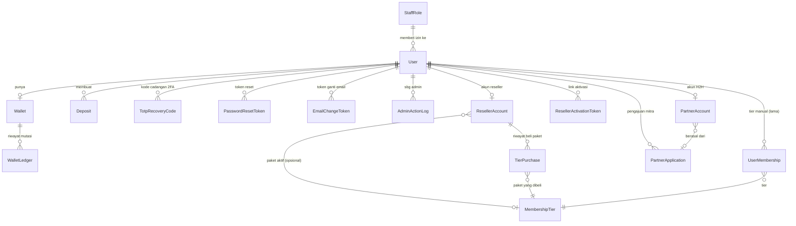
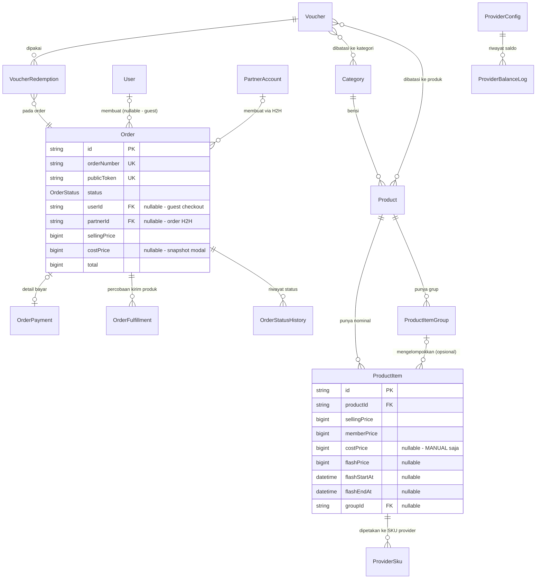

# 03 — Backend & API

## 1. Dua Jenis "Backend" di Proyek Ini

Baca dulu `docs/01-ARSITEKTUR.md` §4 kalau belum. Singkatnya proyek ini punya dua cara memanggil kode server, dan keduanya sama-sama "backend":

| | **Server Action** | **API Route** |
|---|---|---|
| Bentuknya | Fungsi TypeScript biasa yang ditandai `"use server"` | Berkas `route.ts` yang membalas HTTP |
| Dipanggil dari | Komponen React (`<form action={...}>`, atau `onClick`) | `curl`, webhook provider, cron, `fetch()` dari browser |
| Punya URL? | **Tidak** yang bisa kamu ketik — Next.js membuatkan endpoint tersembunyi ber-ID acak | Ya, persis seperti tertulis di berkasnya |
| Dipakai untuk | **Hampir semua hal** di aplikasi ini | HANYA webhook, polling status, cron, dan API partner |

Aturan praktisnya: **kalau yang memanggil adalah halaman kita sendiri, pakai Server Action. Kalau yang memanggil adalah komputer di luar sana, baru bikin API Route.**

> ⚠️ Server Action **bukan** fungsi private. Di balik layar ia tetap endpoint HTTP yang bisa dipanggil siapa pun yang tahu ID-nya. Jadi setiap action admin **wajib** memeriksa izin di dalam dirinya sendiri — tidak cukup mengandalkan tombolnya disembunyikan di UI.

## 2. API Route Handlers (`web/src/app/api/**/route.ts`)

Ada **17 berkas route**. Semuanya menerima/mengembalikan HTTP biasa.

### 2.1 Route internal & publik

| Method | URL | Fungsi | Proteksi |
|---|---|---|---|
| GET, POST | `/api/auth/[...nextauth]` | Handler bawaan NextAuth — melayani `/api/auth/session`, `/api/auth/callback/credentials`, `/api/auth/signout`, dll. | Ditangani penuh oleh NextAuth internal. |
| POST | `/api/cron/tick` | Dipanggil cron eksternal (cPanel Rumahweb) tiap menit — menjalankan job yang sudah jatuh tempo. Lihat `docs/01-ARSITEKTUR.md` §6. | `isAuthorizedCron()` — menerima header `x-cron-secret` **atau** `Authorization: Bearer <CRON_SECRET>` (bentuk yang dipakai Vercel Cron). Dibandingkan `safeCompare`, timing-safe. |
| GET | `/api/search` | Pencarian produk storefront (kotak cari di header). | **Publik, tanpa proteksi.** |
| POST | `/api/track` | Beacon statistik kunjungan halaman → tabel `PageView`. | Publik, tapi menyaring bot lewat `isLikelyBot()` + 60/menit per IP. **Selalu membalas 204**, apa pun yang terjadi — balasan error cuma jadi tulisan merah di konsol pengunjung tanpa ada yang bisa memanfaatkannya. |
| GET | `/api/orders/[token]/status` | Polling status pesanan untuk halaman invoice. | **Tidak perlu login** — akses dijaga murni lewat kepemilikan `publicToken` acak di URL. `force-dynamic`. |
| GET | `/api/deposits/[depositId]/status` | Polling status pembayaran deposit. | Wajib login; deposit harus milik `session.user.id`. |
| POST | `/api/webhooks/midtrans` | Notifikasi status pembayaran dari Midtrans. Alur lengkap di `docs/04` §2.6. | Body dibatasi 16.000 byte; signature diverifikasi **sebelum** menyentuh database; idempotent lewat `WebhookEvent.eventKey`. |
| POST | `/api/webhooks/digiflazz` | Notifikasi status pengiriman produk dari Digiflazz. Lihat `docs/04` §3.7. | Verifikasi signature dulu, idempotent. **Menolak semua request kalau `webhookSecret` belum diisi admin** (fail-closed). |
| GET | `/api/webhooks/okeconnect/[secret]` | Callback status transaksi dari OkeConnect. | ⚠️ **OkeConnect tidak menandatangani callback-nya sama sekali.** Rahasianya ada di dalam URL, dan itu satu-satunya yang membuktikan pengirim. Karena itu isi `message` **tidak pernah** dipakai menetapkan status — callback cuma jadi **pemicu** untuk memanggil `checkStatus` balik ke OkeConnect, dan jawaban itulah yang menentukan. Jangan pernah "menyederhanakan" berkas ini. |

### 2.2 Route admin (JSON, dipanggil dari panel)

Ketiganya memakai gerbang yang sama dengan server action (`requireAdminSession`, §4.3) — termasuk pemeriksaan ulang ke database, bukan sekadar percaya isi token.

| Method | URL | Fungsi | Izin yang dibutuhkan |
|---|---|---|---|
| GET | `/api/admin/provider-price-list` | Cari SKU di cache harga provider (query `provider`, `q`). Dipakai kotak pemetaan SKU di halaman edit produk & import massal. | `payments.manage` |
| GET | `/api/admin/provider-logs` | Riwayat panggilan API provider dalam JSON mentah, untuk **diolah** (hitung kegagalan sejenis, salin payload utuh ke tiket support provider). Filter: `orderNumber`, `ourRefId`, `provider`, `operation`, `outcome`, `since`, `limit` (maks 500). | `payments.manage` |
| GET | `/api/admin/analytics/live` | Snapshot "tampilan langsung" panel analytics, di-poll klien tiap ~10 detik. Sengaja polling, **bukan** SSE/WebSocket: di serverless, koneksi yang dibiarkan terbuka semalaman dibayar per detik. | `system.manage` |

> 🐛 **Ketimpangan yang perlu diketahui:** halaman `/admin/products/*` butuh izin `catalog.manage`, tapi kotak pencarian SKU di dalamnya memanggil `/api/admin/provider-price-list` yang butuh `payments.manage`. Karyawan yang cuma punya `catalog.manage` bisa membuka halamannya, tapi kotak cari SKU-nya akan selalu kosong (403 diam-diam). Aman — gagalnya menutup, bukan membuka — tapi membingungkan. Keputusan mana yang benar (longgarkan izin API-nya, atau kunci halamannya) belum diambil.

### 2.3 Rate limit berbasis IP di `proxy.ts`

Sebelum request sampai ke route handler-nya, `web/src/proxy.ts` sudah menjatuhkan batas per-IP:

| Jalur | Batas | Catatan |
|---|---|---|
| `POST /login` | 5/menit | Hanya `POST` — prefetch Next.js dari `<Link href="/login">` mengirim GET diam-diam dan dulu memakan jatah ini. |
| `POST /register` | 3/menit | Sama, `POST` saja. |
| `/api/webhooks/midtrans` | 60/menit | |
| `/api/webhooks/digiflazz` | 60/menit | |
| `/api/cron/tick` | 10/menit | **Dilewati** kalau pemanggilnya sudah membawa secret cron yang sah — IP dari `X-Forwarded-For` bisa dipalsukan, jadi limit IP di sini malah jadi lubang DoS untuk endpoint yang sudah punya autentikasinya sendiri. |
| `/api/orders/*/status` | 120/menit | Halaman invoice polling tiap 3 detik (~20 req/menit **per tab**). Dua pembeli di NAT yang sama cukup untuk menjebol limit 30 dan merusak layar tunggu bayar. |
| `/api/v1/*` | 300/menit | Ini **lantai anti-banjir per IP**, bukan kuota partner. Kuota sungguhannya ada di `authenticatePartner()` dan dikunci ke *username*, supaya satu partner yang mengamuk tidak mematikan partner lain yang kebetulan sekantor. |

## 3. API Partner (`/api/v1/*`) — satu-satunya API untuk pihak luar

Jalur H2H reseller. **Spesifikasi yang dikirim ke partner ada di `web/src/content/api-partner.md`**, dirender untuk mitra di `/mitra/dokumentasi` — dokumen itu ditulis untuk pembaca di luar tim, jangan menaruh detail internal di sana. Yang di bawah ini catatan sisi kita.

| Method | URL | Fungsi | Signature & kuota |
|---|---|---|---|
| POST | `/api/v1/cek-saldo` | Sisa saldo prabayar partner. | `sign` = md5(username + apiKey + `depo`). 60/menit per username. |
| POST | `/api/v1/price-list` | Katalog + harga yang berlaku untuk partner itu. | Salt `pricelist`. 12/menit — sengaja ketat, satu panggilan membaca seluruh katalog. |
| POST | `/api/v1/transaction` | Buat transaksi, debit saldo, kirim ke provider. | Salt = `ref_id`. 120/menit. |
| POST | `/api/v1/transaction/status` | Cek status transaksi partner. | Salt = `ref_id`. 240/menit. |
| GET | `/api/v1/ip` | Memberi tahu pemanggil, **IP berapa yang kami lihat**. | **Sengaja tanpa autentikasi** — gunanya justru dipakai sebelum integrasi partner jalan. |

Hal-hal yang perlu diketahui sebelum menyentuh jalur ini:

- **Gerbang tunggalnya `authenticatePartner()`** (`web/src/lib/partner/auth.ts`). Urutan pemeriksaannya disengaja: rate limit → lookup partner → **whitelist IP → signature** → status ban akun. IP diperiksa sebelum signature supaya partner yang lupa mendaftarkan IP tidak menerima pesan "signature salah" yang menyesatkan.
- **Kenapa `/api/v1/ip` ada dan kenapa ia terbuka.** Whitelist IP adalah penyebab kegagalan pertama yang paling sering di API bergaya ini: mitra mendaftarkan IP yang dia lihat di browser, padahal servernya keluar lewat NAT dengan alamat yang sama sekali berbeda. Tidak ada rahasia yang bocor — jawabannya adalah alamat pemanggil itu sendiri, yang memang sudah dia kirim ke kami untuk bisa sampai ke sini. Kita mengalami kelas masalah yang persis sama dari sisi sebaliknya dengan Digiflazz `rc 45` (`docs/08-IP-TETAP-DIGIFLAZZ.md`).
- **`apiKey` disimpan TERENKRIPSI (AES-256-GCM), bukan di-hash.** Skema md5 mengharuskan server menghitung ulang hash yang sama, jadi key aslinya harus bisa dibaca kembali. Pola & alasannya sama persis dengan kredensial provider di `ProviderConfig.credentials`.
- **Partner = `User` biasa + baris `PartnerAccount`.** Saldo, ledger, debit atomik, auto-refund, dan halaman `/admin/wallet-ledger` semuanya dipakai ulang apa adanya. Partner juga mengisi saldo lewat `/account/deposit` yang sudah ada — nol kode top-up baru.
- **Harga partner = harga jual − diskon tier akunnya**, lewat `effectivePrice()` yang sama dengan storefront. Tidak ada tabel harga partner terpisah; admin cukup memberi akun partner sebuah tier.
- **`@@unique([partnerId, partnerRefId])` adalah penjamin idempotensi.** Jangan pernah dilepas. `ref_id` yang sama dengan isi request yang sama mengembalikan order aslinya (`replayed: true`); dengan isi berbeda ditolak `rc 21`.
- **Produk `fulfillmentMode: MANUAL` ditolak** di price list maupun transaksi — order manual berhenti menunggu admin dan dari sisi partner tampak menggantung tanpa batas.
- **Callback keluar lewat job `partner-callback`** (`web/src/lib/partner/callback.ts`), ditandatangani HMAC-SHA256 dengan `callbackSecret`. Retry/backoff-nya memakai mesin generik `runDueJobs`. Dipicu dari 4 titik status final: dua di `lib/order/fulfillment.ts` (sukses & auto-refund), dua di `actions/orders.ts` (tandai selesai manual & tandai refunded).
- **`toPartnerStatus()`** (`web/src/lib/partner/response.ts`) adalah satu-satunya penerjemah 9 `OrderStatus` internal → 3 status partner. Status yang belum dikenal jatuh ke `Pending`, bukan `Gagal` — supaya partner tidak merefund customer untuk transaksi yang masih berjalan.

## 4. Server Actions (`web/src/app/actions/*.ts`)

**30 berkas.** Dikelompokkan menurut siapa yang boleh memanggilnya.

### 4.1 Action publik & pembeli

| Berkas | Fungsi yang di-export | Untuk apa | Siapa yang boleh |
|---|---|---|---|
| `auth.ts` | `loginAction`, `registerAction`, `forgotPasswordAction`, `resetPasswordAction`, `logoutAction` | Login (dua langkah, §5.1), daftar, lupa & reset password, logout. | Publik |
| `checkout.ts` | `createCheckoutOrder` | **Entry point checkout** — alur lengkapnya di `docs/04` §4. | Publik (boleh tamu) |
| `deposit.ts` | `createDeposit` | Isi saldo wallet. | Login |
| `order-lookup.ts` | `lookupOrder`, `cancelOrderByToken` | "Cek Transaksi" tanpa login, dan tombol batalkan di halaman invoice. | Publik (dijaga email / token) |
| `voucher.ts` | `previewVoucher` | Cek kode promo di halaman checkout sebelum bayar. | Publik |
| `id-check.ts` | `checkGameId` | Cek nickname/ID game di halaman produk. Dibatasi 15/menit per IP — tanpa itu toko kita jadi proksi cek-ID gratis yang menghabiskan kuota API penyedia. | Publik |
| `membership.ts` | `getPublicTierPriceTable` | Tabel harga per tier untuk halaman publik. | Publik |
| `account.ts` | `changePassword`, `requestEmailChangeAction`, `confirmEmailChangeAction`, `changeName`, `logoutAfterAccountChange` | Kelola akun sendiri di `/account/settings`. | Login |
| `two-factor.ts` | `startTwoFactorSetup`, `confirmTwoFactorSetup`, `disableTwoFactorAction` | Pasang/lepas 2FA untuk akun sendiri. | Login |
| `reseller.ts` | `registerResellerPublic`, `registerResellerFromAccount`, `resendResellerActivation`, `buyResellerTier` | Daftar jadi reseller & beli paket tier. | Publik / login |
| `reseller-activate.ts` | `activateResellerAction` | Aktivasi lewat link di email (30 menit, sekali pakai). | Token |
| `partner-application.ts` | `submitPartnerApplication`, `cancelPartnerApplication` | Ajukan diri jadi mitra H2H dari `/account/mitra`. | Login |
| `mitra.ts` | `updateMitraConfig`, `revealMitraCredentials`, `regenerateMitraApiKey`, `regenerateMitraCallbackSecret`, `resendMitraCallback` | Portal mitra `/mitra/*` — mitra mengurus kredensial & callback-nya sendiri. | `requireActivePartner()` (mitra aktif, bukan admin) |

### 4.2 Action admin

Tiap berkas mendeklarasikan gerbangnya di satu baris paling atas, lalu semua fungsi di dalamnya memakainya:

```ts
// contoh dari actions/catalog.ts
const requireAdmin = () => requireAdminSession("catalog.manage");
```

| Berkas | Izin yang dibutuhkan | Fungsi yang di-export |
|---|---|---|
| `orders.ts` | **dua gerbang** — lihat catatan di bawah | `cancelOrderAction`🔴, `retryFulfillmentAction`, `retryRefundAction`🔴, `markCompletedManualAction`, `markRefundedAction`🔴 |
| `catalog.ts` | `catalog.manage` | `uploadProductBanner`, `createProduct`, `updateProduct`, `toggleProductActive`, `deleteProduct`, `createProductItem`, `updateProductItem`, `deleteProductItem`, `deleteProductItems`, `createProductItemGroup`, `updateProductItemGroup`, `deleteProductItemGroup`, `previewBulkMarkup`, `applyBulkMarkup`, `mapProviderSku`, `setPrimaryProviderSku`, `unmapProviderSku`, `bulkImportProducts` |
| `categories.ts` | `catalog.manage` | `createCategory`, `updateCategory`, `updateCategoryAutoMargin`, `deleteCategory` |
| `vouchers.ts` | `catalog.manage` | `saveVoucher`, `deleteVoucher`, `toggleVoucherActive` |
| `admin-users.ts` | `users.manage` | `banUser`, `unbanUser`, `resetUserPassword` |
| `admin-membership.ts` | `users.manage` | `createMembershipTier`, `updateMembershipTier`, `deleteMembershipTier`, `grantMembership`, `previewTierPricing` |
| `admin-reseller.ts` | `users.manage` | `setResellerActive` |
| `banners.ts` | `storefront.manage` | `uploadBannerImage`, `createBanner`, `updateBanner`, `deleteBanner` |
| `appearance.ts` | `storefront.manage` | `saveAppearanceAction`, `previewSlotHtml` |
| `invoice-settings.ts` | `storefront.manage` | `uploadInvoiceLogo`, `saveBranding`, `saveEmailTemplateAction`, `resetEmailTemplateAction`, `previewEmailTemplateAction`, `saveManualOrderSettingsAction` |
| `settings.ts` | `storefront.manage` | `uploadLogoFile`, `saveLogo`, `saveTrendingMode`, `uploadFaviconFile`, `saveFavicon`, `saveFaqItems`, `saveTosContent`, `savePrivacyContent`, `saveContactSettings`, `saveEmailConfig`, `saveTelegramConfig`, `sendTelegramTest`, `changeAdminPassword`, `saveMaintenanceMode` |
| `payment-config.ts` | `payments.manage` | `saveMidtransCredentials`, `testMidtransConnection`, `testPaymentChannels`, `savePaymentRulesAction` |
| `payment-methods.ts` | `payments.manage` | `uploadPaymentMethodLogo`, `updatePaymentMethod` |
| `providers.ts` | `payments.manage` | `saveDigiflazzCredentials`, `saveOkeConnectCredentials`, `toggleProviderActive`, `checkProviderBalance`, `sendTestTransaction`, `checkTestTransactionStatus`, `syncProviderNow`, `saveBalanceThreshold` |
| `id-check.ts` | `payments.manage` (untuk 2 fungsi admin-nya) | `saveIdCheckConfigAction`, `testIdCheckAction` |
| `partners.ts` | `system.manage` | `createPartnerAction`, `updatePartnerAction`, `regeneratePartnerKeyAction`, `approvePartnerApplicationAction`, `rejectPartnerApplicationAction`, `regenerateCallbackSecretAction` |
| `pwa.ts` | `system.manage` | `uploadPwaIcon`, `uploadPwaSplash`, `savePwaAppSettings` |
| `staff.ts` | **`requireOwner()` — role ADMIN saja** | `createStaffRole`, `updateStaffRole`, `deleteStaffRole`, `assignStaffRole`, `revokeStaff` |

🔴 **`orders.ts` sengaja punya DUA gerbang, bukan satu.** `requireAdmin` (`orders.view`) untuk yang memproses pesanan — ulang pengiriman, tandai selesai manual. `requireRefunder` (`orders.refund`) untuk yang **mengeluarkan uang** — batalkan pesanan, ulang refund, tandai sudah direfund. Orang yang tugasnya melayani pesanan tidak otomatis boleh mengembalikan uang; itulah gunanya izin dipisah.

Sebagian besar action admin juga memanggil `logAdminAction()` untuk mencatat jejak ke tabel `AdminActionLog`.

## 5. Autentikasi & Otorisasi

### 5.1 Cara login bekerja — **dua langkah**

Berkas: `web/src/lib/auth.ts` + `web/src/lib/auth.config.ts` + `web/src/lib/auth/credentials.ts`. Pakai **NextAuth v5 (Auth.js)** dengan provider `Credentials` (email + password) — bukan Google/OAuth.

Yang memutuskan boleh-tidaknya masuk cuma **satu fungsi**: `checkCredentials()` di `lib/auth/credentials.ts`. Ia dipanggil dua kali oleh dua pihak berbeda:

1. **Langkah pertama form login** — cuma ingin tahu: perlu menampilkan kolom kode 2FA atau tidak?
2. **`authorize()` milik NextAuth** — yang benar-benar menerbitkan sesi.

Kenapa disatukan: aturan "kapan sebuah login diterima" adalah hal yang paling mahal kalau punya dua salinan yang menyimpang — salinan yang lebih longgar jadi pintu masuk, dan tidak ada satu pun error yang menandainya.

Jawabannya cuma tiga kemungkinan:

| Jawaban | Artinya |
|---|---|
| `ok` | Password benar, faktor kedua (kalau ada) sudah terpenuhi. |
| `invalid` | Password salah, **atau** akun tidak ada, **atau** akun ditangguhkan, **atau** kode 2FA salah. Sengaja tidak dibedakan. |
| `totp_required` | Password **benar**, tapi akun ini pakai 2FA dan kodenya belum diisi. |

> ⚠️ **Urutan pemeriksaannya ADALAH keamanannya. Jangan diubah.**
> `password → ban → 2FA`.
> Ban dicek **setelah** password, supaya password salah pada akun banned berperilaku persis sama dengan akun biasa (tidak membocorkan bahwa akun itu ada). Tapi dicek **sebelum** cabang 2FA, karena akun banned yang menjawab `totp_required` sama saja mengumumkan "akun ini ada dan passwordnya barusan benar".

Alur dua langkah ini **sengaja tidak lewat pipa error NextAuth** (melempar `CredentialsSignin` ber-`code` lalu menangkapnya lagi). Cara itu bergantung pada bagaimana `@auth/core` kebetulan membungkus lemparan, berubah antar rilis beta, dan mustahil diuji tanpa menjalankan seluruh mesin NextAuth.

Password di-hash pakai `bcryptjs` (`web/src/lib/password.ts`), **tidak pernah** disimpan atau dibandingkan sebagai teks biasa.

> 🪤 **Jebakan React 19 yang pernah mengunci semua admin dari produksi:** di form multi-langkah seperti ini, input **wajib** controlled. React 19 me-reset input tak-terkendali setiap kali sebuah form action selesai — akibatnya langkah kedua mengirim kode 2FA yang benar **tanpa email & password**, dan pesan galatnya menuduh kodenya yang salah. Lihat `docs/06-TROUBLESHOOTING-DEPLOY.md`.

### 5.2 Session — masa berlaku berbeda per peran

```ts
// web/src/lib/auth.config.ts
const SESSION_MAX_AGE_USER  = 30 * 24 * 60 * 60; // 30 hari
const SESSION_MAX_AGE_ADMIN = 12 * 60 * 60;      // 12 jam

session: { strategy: "jwt", maxAge: SESSION_MAX_AGE_USER },
```

Session disimpan sebagai **JWT**, bukan tabel session di database.

NextAuth cuma menerima **satu** `maxAge` global, jadi masa yang lebih pendek untuk admin tidak bisa diatur di situ. Caranya: callback `jwt()` menulis ulang `token.exp` sendiri — 12 jam kalau `role === "ADMIN"`, 30 hari kalau bukan. Pembeli tidak perlu login ulang tiap minggu; sesi admin tidak boleh menggantung semalaman di HP yang ketinggalan.

**Yang TIDAK boleh dipercaya dari token:** peran dan izin. JWT di sini *stateless* dan berumur panjang, jadi token yang terbit sebelum izinnya dicabut akan terus membawa izin lama sampai kedaluwarsa. Karena itu setiap gerbang admin **membaca ulang baris `User` dari database** (§5.3). Pencabutan hak harus berlaku pada request berikutnya, bukan 12 jam lagi.

`updatedAt` user ikut disisipkan ke token dan dibandingkan di setiap gerbang. Ini yang menegakkan ban & pencabutan sesi — dan punya efek samping yang **wajib diingat**:

> ⚠️ **Menulis apa pun ke tabel `User` menendang sesi admin.** `db.user.update()` menaikkan `updatedAt`, tidak cocok lagi dengan JWT, dan `proxy.ts` mengalihkan ke `/login`. Gejala penandanya: Server Action membalas **403 + "An unexpected response was received from the server"**. Solusinya menulis lewat `$executeRaw`. Sudah pernah membuat 2FA gagal dan layar putih di produksi.

### 5.3 Role & izin (RBAC)

Ada **3 role** (`enum Role` di `web/prisma/schema.prisma`):

| Role | Artinya |
|---|---|
| `USER` | Pembeli biasa. Tidak bisa masuk `/admin` sama sekali. |
| `ADMIN` | Pemilik toko. **Selalu lolos semua pemeriksaan izin**, tanpa perlu dicentang apa pun. |
| `STAFF` | Karyawan panel. Boleh masuk `/admin`, tapi **hanya sejauh izin di `StaffRole`-nya**. |

Kenapa `ADMIN` dibuat lolos otomatis alih-alih diberi semua izin: pemilik toko tidak boleh bisa mengunci dirinya sendiri di luar panelnya sendiri, dan "daftar izin yang harus ikut diperbarui setiap kali ada izin baru" adalah cara paling mudah untuk itu terjadi tanpa disadari.

#### 9 izin yang ada

Didefinisikan **di kode** (`web/src/lib/rbac/permissions.ts`), bukan dibuat admin. Alasannya: setiap key di sini wajib benar-benar diperiksa oleh sesuatu. Izin yang cuma bisa dicentang tapi tidak pernah dicek adalah **lubang yang terlihat seperti pagar**.

| Izin | Label di panel | Cakupan |
|---|---|---|
| `orders.view` | Kelola pesanan | Buka daftar & detail pesanan, ulang pengiriman gagal, tandai pesanan manual selesai. |
| `orders.refund` 🔴 | Refund & batalkan pesanan | Mengembalikan uang pembeli & membatalkan pesanan. |
| `finance.view` | Lihat keuangan | Dashboard omzet, Mutasi Saldo, Laporan Penjualan. **Tanpa ini, halaman depan panel tidak terbuka** karena isinya angka pendapatan. |
| `catalog.manage` | Kelola katalog | Produk & harga, kategori, markup, kode promo. |
| `users.view` | Lihat user & tier | Daftar user, detail user, daftar tier — **tanpa** bisa mengubah apa pun. |
| `users.manage` 🔴 | Kelola akun user | Tangguhkan/pulihkan akun, reset password user, buat & ubah tier, beri tier manual. |
| `storefront.manage` | Kelola tampilan toko | Banner, tampilan & tema, invoice & struk, pengaturan situs. |
| `payments.manage` 🔴 | Kelola pembayaran & provider | Payment gateway, metode bayar, provider, cek ID, log callback/API. **Termasuk kredensial.** |
| `system.manage` | Kelola sistem | Pengajuan mitra, API partner, analytics, monitoring job, aplikasi mobile. |

🔴 = ditandai `sensitive` di katalog: menyentuh **uang** atau **akses akun orang lain**. Panel menonjolkannya supaya admin melihat bedanya saat mencentang.

Yang **bisa** dibuat admin adalah **perannya** (`StaffRole`) — kumpulan izin dari katalog ini yang diberi nama sendiri, misalnya "Operator Order" atau "CS Malam". Dikelola di `/admin/staff`.

> ⚠️ **Mengelola peran & karyawan SENGAJA BUKAN izin.** Ia dikunci ke role `ADMIN` lewat `requireOwner()`. Kalau ia jadi izin biasa, karyawan yang memegangnya bisa menaikkan izinnya sendiri (atau izin temannya) sampai setara pemilik toko — dan tidak ada satu pun error yang akan menandainya.

#### Peta route → izin

`web/src/lib/rbac/access.ts` memegang **satu** tabel `ADMIN_ROUTE_RULES` yang dipakai **middleware maupun sidebar**. Satu peta, dua pemakai: menu yang terlihat selalu sama dengan halaman yang benar-benar bisa dibuka.

Berkas itu **murni**: nol Prisma, nol React, nol ikon. Itu syarat, bukan selera — ia diimpor `proxy.ts`, dan menyeret klien Prisma ke sana akan ikut masuk ke bundel yang dijalankan pada **setiap** request.

| Izin | Halaman |
|---|---|
| *(ADMIN saja)* | `/admin/staff` |
| `orders.view` | `/admin/orders` |
| `finance.view` | `/admin/wallet-ledger`, `/admin/reports`, dan **`/admin` itu sendiri** |
| `catalog.manage` | `/admin/products`, `/admin/categories`, `/admin/markup`, `/admin/vouchers` |
| `users.view` | `/admin/users`, `/admin/membership-tiers`, `/admin/reseller` |
| `storefront.manage` | `/admin/banners`, `/admin/appearance`, `/admin/invoice`, `/admin/settings` |
| `payments.manage` | `/admin/payment-config`, `/admin/payment-methods`, `/admin/providers`, `/admin/id-check`, `/admin/webhooks`, `/admin/provider-logs` |
| `system.manage` | `/admin/partnership`, `/admin/partners`, `/admin/analytics`, `/admin/jobs`, `/admin/mobile-app` |
| *(tanpa izin — cukup bisa masuk panel)* | `/admin/keamanan`, `/admin/panduan` |

Tiga hal tentang tabel ini:

1. **Urutannya penting.** Dari paling spesifik ke paling umum, dan pencocokan berhenti di kecocokan pertama. `/admin` adalah awalan dari semua route lain, jadi ia **wajib** berada paling bawah.
2. 🔴 **Halaman admin BARU yang lupa didaftarkan jatuh ke aturan `/admin`, artinya butuh `finance.view`.** Itu disengaja — bawaan yang salah-arah lebih baik **menutup** daripada membuka. Tapi artinya: **kalau kamu menambah halaman admin, tambahkan barisnya di sini.** Lihat `docs/05-CARA-TAMBAH-FITUR.md`.
3. **`/admin/keamanan` sengaja tanpa izin.** Menggerbangnya akan mengunci karyawan di luar panel **selamanya**: gerbang 2FA mewajibkan mereka memasang 2FA lebih dulu, dan satu-satunya tempat memasangnya ada di halaman itu.

Karyawan yang membuka halaman yang tidak boleh dia akses **tidak** ditolak mentah-mentah, tapi diantar ke halaman pertama yang boleh dia buka (`firstAllowedAdminPath`). Tujuan yang paling sering ditolak adalah `/admin` itu sendiri — halaman yang otomatis dituju setiap kali karyawan login, jadi layar "akses ditolak" di sana akan terasa seperti akunnya rusak. `/admin/keamanan` jadi jaring terakhirnya, karena izinnya `null` sehingga mustahil mengembalikan tujuan yang justru ditolak lagi dan berputar-putar.

#### Tiga lapis penegakan

| Lapis | Berkas | Yang dijaga |
|---|---|---|
| 1. Middleware | `web/src/proxy.ts` | Boleh masuk panel? Boleh buka **halaman ini**? Sudah pasang 2FA? Semuanya sebelum halaman dirender sama sekali. |
| 2. Layout | `web/src/app/admin/layout.tsx` | Cek ulang, plus menyusun sidebar dari `ADMIN_ROUTE_RULES` yang sama. |
| 3. Tiap server action & route API admin | `lib/auth/admin-gate.ts` | Lapis terakhir, paling dekat dengan mutasi data yang sesungguhnya. |

> 🔴 **Lapis 3 bukan formalitas.** Server Action adalah endpoint HTTP. Middleware tidak melindunginya dari pemanggilan langsung — yang melindunginya cuma pemeriksaan di dalam action itu sendiri.

> ⚠️ **Penegakan berbasis route WAJIB di middleware, bukan di layout.** Layout Next.js **tidak dijalankan ulang** saat berpindah halaman dari dalam aplikasi — hanya saat halaman dimuat penuh. Gerbang berbasis route di layout menyala tidak konsisten, dan sudah pernah mengunci admin dari produksi (halaman `/admin/keamanan` mengalihkan dirinya sendiri). Middleware tidak punya masalah itu: ia jalan di setiap request, dan `nextUrl.pathname` selalu ada.

#### `lib/auth/admin-gate.ts` — satu gerbang untuk semuanya

```ts
const admin = await requireAdminSession("catalog.manage");
if ("error" in admin) return { error: admin.error };
// admin.adminId, admin.role, admin.permissions siap dipakai
```

Dua fungsi saja:

- **`requireAdminSession(permission?)`** — gerbang normal. Membaca baris `User` **segar dari database**: cek `bannedAt`, cocokkan `updatedAt` dengan JWT, pastikan role `ADMIN`/`STAFF`, lalu baca izin dari `StaffRole`. Peran yang **dinonaktifkan** (`isActive: false`) langsung kehilangan seluruh izinnya tanpa perlu melepas penugasannya dari tiap karyawan satu per satu — itu gunanya tombol nonaktif.
- **`requireOwner()`** — untuk hal yang tidak boleh didelegasikan ke karyawan mana pun (kelola peran & karyawan).

Pesan penolakannya **seragam** untuk semua sebab (bukan admin / sesi basi / akun ditangguhkan / izin kurang). Membedakannya cuma memberi tahu penebak sejauh mana tebakannya sudah benar.

> 📌 **Catatan sejarah, supaya tidak terulang.** Berkas ini menggantikan **16 salinan** `requireAdmin` yang tersebar di `app/actions/*.ts` dan sudah mulai berbeda satu sama lain. Komentar di berkas-berkas lama menyebut duplikasi itu perlu karena "berkas `use server` hanya boleh mengekspor async function" — **alasan itu keliru**: berkas-berkas itu menaruh `"use server"` di dalam *badan* fungsi, jadi modulnya modul biasa dan bebas mengimpor apa saja. (Bahkan pada berkas `"use server"` tingkat-modul, yang dibatasi adalah apa yang boleh **di-ekspor**, bukan apa yang boleh **di-impor**.) Bahayanya bukan soal rapi: satu salinan yang ketinggalan diperbarui berarti aksi itu masih bisa dipanggil oleh orang yang tidak berhak — tanpa error, tanpa tanda apa pun di layar.

### 5.4 2FA wajib untuk seluruh panel

Ditegakkan di `proxy.ts`, bukan di layout (alasannya di §5.3). Siapa pun yang `canEnterAdmin()` — **termasuk STAFF, bukan cuma pemilik toko** — dialihkan ke `/admin/keamanan` sampai `totpEnabledAt` terisi.

Karyawan ikut wajib karena akun mereka memegang akses ke pesanan, harga, dan data pembeli — dan justru akun karyawanlah yang paling mungkin passwordnya dipakai ulang di tempat lain.

Statusnya dibaca dari **database**, bukan dari isi sesi: token yang terbit sebelum 2FA dipasang akan terus mengklaim keadaan lama sampai kedaluwarsa.

**Dua pengecualian, keduanya wajib ada:**

- `/admin/keamanan` — kalau ikut digerbang, halaman yang harus dibuka untuk memasang 2FA justru mengalihkan ke dirinya sendiri.
- `/admin/app.webmanifest` — browser mengambil manifest dengan `credentials: "omit"`, jadi cookie sesi **tidak ikut terkirim** seberapa pun sahnya admin yang sedang membukanya. Kalau ikut digerbang, yang diterima browser adalah pengalihan ke `/login`, dan gejalanya bukan pesan error melainkan **app admin yang sekadar tidak mau terpasang**.

### 5.5 Halaman: siapa butuh login

| Kategori | Halaman | Dijaga oleh |
|---|---|---|
| Publik penuh | `/`, `/[kategori]/[produk]`, `/faq`, `/kontak`, `/syarat-ketentuan`, `/kebijakan-privasi`, `/cek-transaksi`, `/daftar-reseller` | — |
| Publik, dijaga **token di URL** | `/invoice/[token]`, `/invoice/[token]/struk`, `/reset-password`, `/konfirmasi-email`, `/reseller/aktivasi` | Tokennya **adalah** kredensialnya. Acak, 30 menit, sekali pakai. Karena itu semua halaman ini juga dikecualikan dari mode maintenance — link masuk lewat email dan keburu mati sebelum toko dibuka lagi. |
| Wajib login | `/account/*` (`/orders`, `/deposit`, `/deposits`, `/settings`, `/mitra`, `/reseller`) | `proxy.ts` |
| Wajib login + **mitra aktif** | `/mitra/*` (`/katalog`, `/transaksi`, `/saldo`, `/kredensial`, `/callback`, `/dokumentasi`) | `proxy.ts` cuma cek "sudah login"; status mitranya diperiksa `app/mitra/layout.tsx`, yang bisa membedakan "bukan mitra" (diantar ke formulir pengajuan) dari "mitra nonaktif" (tetap boleh membaca portalnya). Middleware tidak punya konteks untuk membedakan itu tanpa query DB kedua. |
| Wajib ADMIN/STAFF + 2FA + izin | `/admin/*` (28 halaman) | §5.3 |

## 6. Struktur Database — ERD

Sumber kebenaran: `web/prisma/schema.prisma` — **41 model, 18 enum**. Diagram di bawah dipecah per klaster supaya terbaca; model operasional tanpa relasi FK didaftar di §6.4.

### 6.1 Klaster akun, uang & keanggotaan



### 6.2 Klaster katalog & pesanan



### 6.3 Penjelasan relasi penting

- **`Order.userId` opsional (`String?`)** — order boleh tidak terkait `User` sama sekali (checkout tamu). Ini keputusan desain inti, bukan bug: jangan mengasumsikan `order.userId` selalu ada di kode baru.
- **`Order.partnerId` juga opsional** — terisi hanya untuk order yang masuk lewat `/api/v1/transaction`. Satu tabel `Order` melayani storefront **dan** H2H.
- **`Order.costPrice` adalah SNAPSHOT, dan boleh `null`.** Diisi saat checkout untuk produk `MANUAL`, dan saat **fulfillment berhasil** untuk produk `AUTO` (karena modal sesungguhnya baru diketahui setelah provider menjawab). 🔴 **`null` ≠ nol** — order tanpa modal tercatat harus dikeluarkan dari perhitungan laba, bukan dihitung sebagai laba 100%.
- **`ProductItem.costPrice` cuma untuk produk MANUAL.** Produk `AUTO` modalnya datang dari `ProviderSku`.
- **`ResellerAccount.tierId` opsional** — paket **GRATIS diwakili tier `null`**, bukan sebuah baris `MembershipTier`. Reseller tanpa tier tetap punya `ResellerAccount`.
- **`UserMembership` adalah peninggalan sistem lama** yang sudah digantikan `ResellerAccount`. Kolom `durationDays` di `MembershipTier` sudah **usang** — tier sekarang LIFETIME.
- **`ProductItem.groupId` opsional + `onDelete: SetNull`** — hapus `ProductItemGroup` **tidak** menghapus item di dalamnya, cuma melepas relasinya.
- **`ProviderSku`** unique per `[productItemId, provider]` — satu nominal cuma boleh punya satu pemetaan per provider.
- **Relasi `Voucher ↔ Category` dan `Voucher ↔ Product` adalah many-to-many** (tabel jembatan dibuat Prisma otomatis). Voucher tanpa entri di keduanya = berlaku untuk semua produk.
- **`VoucherRedemption` di-`onDelete: Cascade` dari dua sisi.** Tapi kuota voucher **tidak** dihitung dari jumlah baris ini secara mentah — ia **diturunkan dari status order**, karena status berpindah ke gagal di 8 tempat berbeda dan counter yang lupa dikurangi akan bocor tanpa satu pun error.

### 6.4 Model operasional (tanpa relasi FK ke model lain)

| Model | Fungsi |
|---|---|
| `Banner` | Banner carousel beranda. |
| `SiteSetting` | Key-value store semua pengaturan situs (logo, favicon, FAQ, tema, PWA, dll.) — lihat `docs/05-CARA-TAMBAH-FITUR.md` untuk menambah pengaturan baru. |
| `PaymentMethodConfig` | Konfigurasi metode pembayaran (fee, logo, aktif/nonaktif) — dihubungkan ke order lewat kolom `code` (string), bukan relasi Prisma. |
| `ProviderConfig` | Kredensial & status tiap provider PPOB. Kredensialnya **terenkripsi**. |
| `ProviderPriceListCache` | Cache lokal seluruh daftar harga provider (untuk pencarian cepat di UI admin). |
| `PriceSyncLog` | Log riwayat sinkronisasi harga. |
| `PriceChangeLog` | Riwayat perubahan harga jual per item — jejak siapa mengubah apa, kapan. |
| `ProviderApiLog` | Rekaman panggilan API provider (request & respons apa adanya, kredensial diredaksi **saat penulisan**). Dibaca `/admin/provider-logs`. |
| `Job` | Antrean job background (lihat `docs/01-ARSITEKTUR.md` §6). |
| `RateLimit` | Counter rate-limiting (dibersihkan berkala oleh job `cleanup-rate-limits`). |
| `WebhookEvent` | Log semua webhook masuk, dengan `eventKey` sebagai penjamin idempotensi. Bisa dilihat di `/admin/webhooks`. |
| `PageView` | Baris mentah kunjungan halaman dari `/api/track`. |
| `AnalyticsDaily` | Agregat harian dari `PageView` — supaya dashboard tidak menghitung ulang jutaan baris tiap dibuka. |

## 7. Enum

**18 enum.** Yang paling sering disentuh:

| Enum | Nilai | Dipakai di |
|---|---|---|
| `Role` | `USER`, `ADMIN`, `STAFF` | `User.role` — §5.3. |
| `OrderStatus` | `PENDING_PAYMENT` → `PAID` → `PROCESSING` → `COMPLETED` (jalur sukses); atau `EXPIRED` / `FAILED` / `NEEDS_REVIEW` / `REFUND_PENDING` / `REFUNDED` (jalur gagal) | `Order.status` — state machine inti seluruh alur transaksi. **Pembatalan pesanan memakai `EXPIRED`, bukan status baru** — `EXPIRED` sudah melepas kuota voucher dan stok secara gratis. |
| `FulfillmentMode` | `AUTO`, `MANUAL` | `Product.fulfillmentMode`. `MANUAL` = admin mengirim sendiri; ditolak di seluruh jalur API partner. |
| `FulfillmentStatus` | `SENT` → `PROCESSING` → `SUCCESS` / `FAILED` | `OrderFulfillment.status` — status tiap percobaan kirim ke provider. |
| `ProviderKey` | `DIGIFLAZZ`, `OKECONNECT`, `QIOSPAY`, `SERPUL` | `ProviderConfig`, `ProviderSku`. Dua yang pertama sudah jalan. |
| `PaidVia` | `MIDTRANS`, `BALANCE` | `Order.paidVia`. |
| `PaymentStatus` | `PENDING`, `PAID`, `EXPIRED`, `FAILED` | `OrderPayment.status`. |
| `DepositStatus` | `PENDING`, `PAID`, `EXPIRED`, `FAILED` | `Deposit.status`. |
| `TierPurchaseStatus` | `PENDING`, `PAID`, `EXPIRED`, `FAILED` | `TierPurchase.status` — pembelian paket reseller. |
| `LedgerType` | `DEPOSIT`, `ORDER_PAYMENT`, `REFUND`, `ADJUSTMENT`, `MEMBERSHIP` | `WalletLedger.type`. `MEMBERSHIP` = beli paket tier pakai saldo. |
| `VoucherDiscountType` | `PERCENT` (boleh dibatasi `maxDiscount`), `FIXED` | `Voucher.discountType`. |
| `AutoMarginMode` | `OFF`, `FOLLOW_DELTA`, `FORMULA` | `Category.autoMarginMode`. `FOLLOW_DELTA` = harga jual bergeser sebesar pergeseran modal (margin tiap item dipertahankan); `FORMULA` = harga jual selalu modal × (1 + margin), seluruh kategori diseragamkan. |
| `JobStatus` | `PENDING` → `RUNNING` → `DONE` / `FAILED` | `Job.status`. |
| `HealthStatus` | `UNKNOWN`, `HEALTHY`, `DEGRADED`, `DOWN` | `ProviderConfig.healthStatus`. |
| `BalanceAlertStatus` | `OK`, `LOW` | `ProviderConfig` — lihat `lib/providers/balance-sync.ts`. Transisi status **wajib** mengirim Telegram walau dipicu admin: mesin statusnya *edge-triggered*, membisukannya membuat alert hilang selamanya. |
| `ProviderSkuStatus` | `ACTIVE`, `UNAVAILABLE` | `ProviderSku.status`. |
| `PartnerApplicationStatus` | `PENDING`, `APPROVED`, `REJECTED` | `PartnerApplication.status`. |
| `PartnerBusinessType` | `PERORANGAN`, `CV`, `PT`, `KOPERASI`, `LAINNYA` | `PartnerApplication.businessType`. |

---

## Cheat Sheet — Backend & API

| Saya mau... | Baca/edit berkas ini |
|---|---|
| Lihat semua endpoint HTTP yang ada | Tabel §2 & §3, atau `web/src/app/api/**/route.ts` |
| Lihat semua "fungsi backend" yang dipanggil dari form | Tabel §4, atau `web/src/app/actions/*.ts` |
| Tambah endpoint API baru | `docs/05-CARA-TAMBAH-FITUR.md` |
| **Tambah halaman admin baru** | 🔴 Wajib mendaftarkannya di `ADMIN_ROUTE_RULES` (`web/src/lib/rbac/access.ts`) — kalau tidak, halaman itu diam-diam butuh `finance.view` |
| Tambah izin baru | `web/src/lib/rbac/permissions.ts` (katalog) → `ADMIN_ROUTE_RULES` (route) → gerbang di action-nya. Izin yang tidak pernah dicek = pagar palsu |
| Ubah siapa yang boleh akses suatu halaman `/admin` | `ADMIN_ROUTE_RULES` di `web/src/lib/rbac/access.ts` — satu tempat, berlaku untuk middleware **dan** sidebar |
| Ubah gerbang server action | `web/src/lib/auth/admin-gate.ts`, lalu baris `const requireAdmin = ...` di berkas action-nya |
| Ubah masa berlaku sesi | `SESSION_MAX_AGE_USER` / `SESSION_MAX_AGE_ADMIN` di `web/src/lib/auth.config.ts` |
| Ubah aturan login / 2FA | `web/src/lib/auth/credentials.ts` (satu-satunya pengambil keputusan) |
| Lihat/ubah struktur tabel database | `web/prisma/schema.prisma`, lalu migrasi (`docs/05-CARA-TAMBAH-FITUR.md`) |
| Debug kenapa suatu action ditolak (403) | Cek `const requireAdmin = ...` di berkas action itu → izin apa yang dibutuhkan → apakah `StaffRole` orang itu punya izinnya & masih `isActive` |
| Debug kenapa karyawan dilempar ke halaman lain saat buka `/admin/...` | `canAccessAdminPath()` menolak → `firstAllowedAdminPath()` mengantar. Cek barisnya di `ADMIN_ROUTE_RULES` |
| Debug **403 + "An unexpected response was received from the server"** | Kemungkinan besar bukan izin: ada kode yang menulis ke tabel `User` dan menendang sesi (§5.2) |
| Lihat log aksi admin | Tabel `AdminActionLog` (belum ada halaman UI khusus — query manual/Prisma Studio) |
