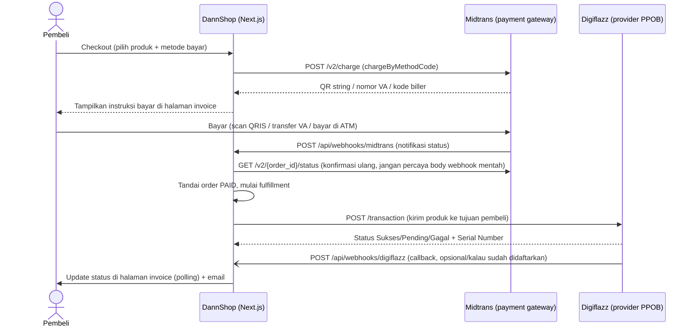

# 04 — Integrasi Payment Gateway & Provider PPOB

Dokumen ini menjelaskan integrasi eksternal yang jadi jantung bisnis DannShop:

1. **Midtrans** (payment gateway) — menerima uang dari pembeli. Dipakai dalam **dua mode**: Core API (utama) dan Snap (fallback), lihat §2.2.
2. **Digiflazz** dan **OkeConnect** (provider/supplier PPOB) — mengirim produk digital (diamond game, pulsa, token listrik, dll.) ke tujuan pembeli. Keduanya **sudah aktif**; produk yang sama bisa dipetakan ke keduanya sekaligus dan sistem memilih otomatis (§3.4).

> Semua path file di dokumen ini relatif dari root repo (`D:\Coding VSC\DannShop-PPOB`), dan aplikasi Next.js-nya ada di folder `web/`.

---

## 1. Ringkasan Arsitektur Integrasi

**Poin penting yang membedakan arsitektur ini dari asumsi umum:**
- **Midtrans dipakai dalam DUA mode, dan admin bisa memindahkannya tanpa deploy** (§2.2). Mode utamanya **Core API** — tidak ada popup, semua instruksi bayar (kode QR, nomor VA, kode biller) dirender langsung di halaman invoice/deposit milik DannShop sendiri. Mode **Snap** ada sebagai fallback karena Core API *production* adalah layanan yang harus diaktifkan terpisah oleh Midtrans.
- **Digiflazz dipantau lewat DUA jalur sekaligus: polling (utama, selalu jalan) + webhook (pelengkap, opsional).** Job `recheck-fulfillment` (§3.5) SELALU dijadwalkan untuk tiap transaksi, apa pun kondisinya — ini jaring pengaman utama. Endpoint `POST /api/webhooks/digiflazz` (`web/src/app/api/webhooks/digiflazz/route.ts`) ADA dan aktif, tapi cuma benar-benar berguna (mempercepat update status jadi hampir instan, bukan menunggu siklus poll) kalau: (1) URL-nya didaftarkan manual di dashboard Digiflazz, DAN (2) "Webhook Secret" diisi sama persis di dua tempat — dashboard Digiflazz dan `/admin/providers` (field kredensial Digiflazz). **Kalau `webhookSecret` belum diisi, endpoint ini otomatis menolak SEMUA request (fail-closed)** — jadi aman dibiarkan apa adanya sampai siap dikonfigurasi, tidak akan pernah salah proses callback palsu.

---

## 2. Midtrans — Payment Gateway

### 2.1 File-file terkait

| File | Fungsi |
|---|---|
| `web/src/lib/midtrans/client.ts` | Semua fungsi pemanggil API Midtrans (`chargeQris`, `chargeBankTransfer`, `chargePermataVA`, `chargeEchannel`, `getTransactionStatus`, `chargeByMethodCode` sebagai dispatcher Core API, dan `createSnapTransaction` untuk mode Snap). |
| `web/src/lib/payment/gateway-config.ts` | **Satu-satunya sumber kredensial & mode Midtrans.** Baca §2.2. |
| `web/src/lib/payment/create-payment.ts` | **Satu-satunya titik yang memutuskan Core API vs Snap.** Baca §2.2. |
| `web/src/lib/payment/settlement.ts` | `settleFromMidtrans()` — apa yang terjadi setelah uang dipastikan masuk. Tiga cabang, lihat §2.7. |
| `web/src/lib/midtrans/signature.ts` | Verifikasi tanda tangan (signature) webhook Midtrans. |
| `web/src/lib/midtrans/status-mapping.ts` | Menerjemahkan status mentah Midtrans (`settlement`, `capture`, `pending`, `expire`, dll.) jadi status internal (`paid`/`pending`/`failed`/`expired`). |
| `web/src/app/api/webhooks/midtrans/route.ts` | Endpoint yang dipanggil Midtrans saat status pembayaran berubah. |
| `web/src/app/actions/checkout.ts` | Checkout produk. |
| `web/src/app/actions/deposit.ts` | Isi saldo. |
| `web/src/app/actions/reseller.ts` | Beli paket reseller (`buyResellerTier`). |
| `web/src/app/actions/payment-config.ts` | Simpan kredensial & mode dari `/admin/payment-config`. |

### 2.2 Kredensial & mode integrasi — **di database, bukan env var**

> 🔴 Bagian ini pernah berbeda. Kredensial Midtrans **tidak lagi** dibaca dari env var sebagai jalur utama.

Kredensial disimpan **terenkripsi (AES-256-GCM) di `SiteSetting`** dengan key `midtrans_config`, diisi lewat panel `/admin/payment-config`. `lib/midtrans/client.ts` sengaja **tidak lagi punya default `process.env`** — supaya tidak ada jalur diam-diam yang memakai key berbeda dari yang dipasang admin di panel. Env var `MIDTRANS_SERVER_KEY` / `MIDTRANS_IS_PRODUCTION` cuma dipakai sebagai **cadangan** kalau baris `midtrans_config` belum ada sama sekali.

Isi konfigurasinya:

| Field | Fungsi |
|---|---|
| `serverKey` | Server key dari dashboard Midtrans. |
| `clientKey` | **Hanya dipakai mode Snap** (popup Snap.js wajib diberi client key di browser). Core API tidak memerlukannya sama sekali. |
| `merchantId` | ID merchant, untuk ditampilkan di panel. |
| `isProduction` | `true` → `api.midtrans.com`, `false` → `api.sandbox.midtrans.com`. |
| `integrationMode` | `"core_api"` (utama) atau `"snap"` (fallback). |

**Kenapa mode Snap ada.** Core API **production** adalah layanan yang harus diaktifkan terpisah oleh Midtrans — di sandbox aktif otomatis, di production **tidak**. Selama pengajuan aktivasi belum disetujui, seluruh charge Core API dibalas `402 "Payment channel is not activated."` padahal Snap di akun yang sama jalan normal. Toggle ini membuat situs tetap bisa menerima uang selama masa tunggu, dan mengembalikannya nanti cukup sekali klik — **tanpa deploy**. Lihat `docs/07-AKTIVASI-CORE-API-MIDTRANS.md`.

**Yang SENGAJA identik di kedua mode** (`lib/payment/create-payment.ts`): `order_id`, `gross_amount` (sudah termasuk fee + kode unik), dan durasi kedaluwarsa. Karena ketiganya sama persis, **webhook, GET status, settlement, dan job expire tidak perlu tahu-menahu soal mode integrasi.** Snap hanya mengubah *cara* pembeli membayar, bukan apa yang ditagih atau bagaimana kita membacanya.

> 🪤 **`finishUrl` wajib diisi dan tipenya memaksa itu.** Snap **tidak pernah** mengirim `callbacks` sendiri: kalau field ini kosong, Midtrans mengembalikan pembeli ke `example.com` dan **tidak ada satu pun error** yang muncul di sisi kita. Mode Core API mengabaikannya (pembeli tidak pernah meninggalkan halaman kita).

> 🪤 **Dua jebakan Midtrans yang sudah memakan waktu:** (1) **prefix server key TIDAK menandakan sandbox/production** — jangan menebak dari bentuk key-nya; (2) **Midtrans membalas HTTP 200 untuk penolakan** — `status_code` di dalam body yang menentukan, mengecek `res.ok` saja percuma.

### 2.3 Metode pembayaran yang didukung

`PaymentMethodConfig.code` di database menentukan metode mana yang aktif. Kode yang dikenali oleh `chargeByMethodCode` (`web/src/lib/midtrans/client.ts:289`):

| Code | Fungsi Midtrans dipanggil | `payment_type` Midtrans | Bentuk hasil ke pembeli |
|---|---|---|---|
| `qris` | `chargeQris` | `qris` | String QR (`qrString`), dirender jadi gambar QR di halaman invoice/deposit lewat library `qrcode` (server-side, lihat §2.5). |
| `va_bca`, `va_bni`, `va_bri`, `va_cimb` | `chargeBankTransfer` | `bank_transfer` + `bank_transfer.bank` | Nomor VA (`vaNumber`) + nama bank. |
| `va_permata` | `chargePermataVA` | `bank_transfer` (tanpa field `bank_transfer` — Midtrans otomatis mengartikannya sebagai Permata) | Nomor VA Permata. Response Midtrans-nya **beda schema** dari BCA/BNI/BRI/CIMB (field top-level `permata_va_number`, bukan array `va_numbers`). |
| `va_mandiri` | `chargeEchannel` | `echannel` (bukan `bank_transfer`!) | **Bukan nomor VA** — sepasang `billerCode` + `billKey` yang dimasukkan lewat ATM/e-banking (Mandiri Bill Payment). |

> **Kalau mau menambah metode pembayaran baru** (mis. metode bank lain yang Midtrans dukung), lihat panduan lengkap di `docs/05-CARA-TAMBAH-FITUR.md`.

### 2.4 `custom_expiry` — sinkronisasi waktu kedaluwarsa

Setiap panggilan charge menyertakan `custom_expiry: { expiry_duration: expiryMinutes, unit: "minute" }` (fungsi `customExpiry` di `client.ts:60`). Ini **wajib** ada — kalau tidak, Midtrans default-nya membuat VA/echannel valid ~24 jam, sementara job lokal (`expire-order`/`expire-deposit`, lihat `web/src/lib/jobs/runner.ts`) menandai order/deposit `EXPIRED` di menit ke-15. Tanpa sinkronisasi ini, pembeli bisa transfer ke VA yang di aplikasi sudah dianggap kedaluwarsa tapi di Midtrans masih hidup — uang masuk tapi tidak pernah diproses otomatis.

### 2.5 QRIS — kenapa harus di-generate ulang di server

`chargeQris` mengembalikan `qrString` (bukan gambar). DannShop men-generate gambar QR dari string itu **sendiri** di server (pakai library `qrcode`), bukan memanggil endpoint gambar pihak ketiga — ini keputusan keamanan (Content Security Policy) yang diambil di fase security-hardening proyek ini, jangan diubah balik ke layanan gambar eksternal tanpa alasan kuat.

### 2.6 Webhook Midtrans — `web/src/app/api/webhooks/midtrans/route.ts`

Alur verifikasi & pemrosesan (baca kode aslinya untuk detail lengkap, ringkasan urutannya):

1. **Cek `MIDTRANS_SERVER_KEY` ada** — kalau tidak ada di env, langsung 500.
2. **Batasi ukuran body** (maks 16.000 byte) — cegah payload raksasa.
3. **Parse & validasi bentuk JSON** (Zod schema `notifSchema`) — harus punya `order_id`, `status_code`, `gross_amount`, `signature_key`, `transaction_status`.
4. **Verifikasi signature** (`verifyMidtransSignature`) — **ini terjadi PALING AWAL**, sebelum baris apa pun disentuh di database. Signature = `SHA512(order_id + status_code + gross_amount + server_key)`, dibandingkan pakai `safeCompare` (timing-safe, lihat `web/src/lib/crypto.ts`) supaya tidak bisa ditebak lewat serangan timing.
5. **Idempotency check** lewat tabel `WebhookEvent` — `eventKey` = `` `midtrans:${order_id}:${transaction_status}` ``. Kalau event dengan key ini sudah pernah `processedAt`-nya terisi, langsung balas `{ deduped: true }` tanpa proses ulang (Midtrans memang bisa mengirim notifikasi yang sama berkali-kali).
6. **Konfirmasi ulang ke Midtrans** lewat `getTransactionStatus(order_id)` — **body webhook mentah TIDAK PERNAH langsung dipercaya** untuk memutuskan status akhir, selalu dicek ulang lewat API GET status. Ini mencegah pemalsuan notifikasi walau signature-nya entah bagaimana valid.
7. **Serahkan ke `settleFromMidtrans(order_id)`** — satu-satunya tempat yang memutuskan "uang ini punya siapa". Lihat §2.7.

### 2.7 `settleFromMidtrans()` — **tiga cabang**, bukan dua

`web/src/lib/payment/settlement.ts`. Satu `order_id` Midtrans bisa berarti tiga hal berbeda, dan fungsi ini mencobanya berurutan:

| Urutan | Cocok ke | `order_id`-nya adalah | Kalau lunas |
|---|---|---|---|
| 1 | `Order` | `Order.orderNumber` | `settleOrder()` → order `PAID` → `dispatchFulfillment()` |
| 2 | `Deposit` | `Deposit.id` | `settleDeposit()` → `Wallet.balance` dikredit + entri `WalletLedger` |
| 3 | `TierPurchase` | `TierPurchase.id` | `settleTierPurchase()` → `ResellerAccount.tierId` di-set |

> 🔴 **Kalau menambah jenis pembayaran baru, cabangnya bertambah DI SINI.** Melewatkannya berarti uang masuk tapi tidak ada yang menerimanya — dan tidak ada error yang muncul, karena dari sisi Midtrans pembayarannya sukses.

Tiga penjaga yang sama dipasang di **ketiga** cabang:

1. **Cek nominal settlement cocok** dengan yang seharusnya. Kalau tidak cocok: order dieskalasi ke `NEEDS_REVIEW`, deposit **tidak dikredit sama sekali**, paket reseller **tidak diberikan** — dan admin dikirim alert.
2. **Klaim atomik**: `updateMany` dengan kondisi status lama di `where`, bukan `update` biasa. Kalau webhook yang sama diproses dua proses bersamaan, cuma satu yang benar-benar mengubah status — ini yang mencegah fulfillment/kredit saldo dobel.
3. **Log keras kalau `paid` datang terlambat** (status sudah bukan `PENDING` lagi). Ini bukan kondisi normal, dan membiarkannya lewat diam-diam berarti kehilangan satu-satunya petunjuk bahwa ada uang yang perlu ditelusuri manual.

### 2.8 Status Mapping (`status-mapping.ts`)

| `transaction_status` Midtrans | `fraud_status` | Hasil (`mapMidtransStatus`) |
|---|---|---|
| `settlement` | — | `paid` |
| `capture` | `accept` | `paid` |
| `capture` | selain `accept` | `failed` |
| `pending` | — | `pending` |
| `expire` | — | `expired` |
| lainnya (`cancel`, `deny`, dll.) | — | `failed` |

---

## 3. Provider PPOB — Digiflazz & OkeConnect

> **Dua provider sudah aktif.** `enum ProviderKey` memuat empat nilai (`DIGIFLAZZ`, `OKECONNECT`, `QIOSPAY`, `SERPUL`), tapi yang punya adapter cuma dua yang pertama. Bagian §3.1–§3.7 di bawah memakai Digiflazz sebagai contoh utama karena ia yang paling lengkap dokumentasinya; **§3.8 khusus membahas apa yang berbeda di OkeConnect** — dan bedanya besar.

### 3.1 File-file terkait

| File | Fungsi |
|---|---|
| `web/src/lib/providers/digiflazz.ts` | `DigiflazzAdapter` class — implementasi konkret pemanggilan API Digiflazz. |
| `web/src/lib/providers/digiflazz-sign.ts` | Fungsi `digiflazzSign` (MD5 signature yang Digiflazz wajibkan di tiap request) + verifikasi signature callback. |
| `web/src/lib/providers/okeconnect.ts` | `OkeConnectAdapter` class — lihat §3.8, perilakunya beda jauh dari Digiflazz. |
| `web/src/lib/providers/types.ts` | Interface `TopupProviderAdapter` — kontrak yang wajib dipenuhi provider mana pun. `QIOSPAY` & `SERPUL` sudah ada di enum tapi **belum ada adapter-nya**. |
| `web/src/lib/providers/registry.ts` | `getAdapter(key)` — satu-satunya pabrik adapter: ambil kredensial dari DB, dekripsi, buat instance. **Logger disuntik di sini**, jadi tidak ada jalur transaksi keluar yang bisa lolos tanpa tercatat di `ProviderApiLog`. |
| `web/src/lib/order/select-provider.ts` | `selectFulfillmentSku()` + `compareFulfillmentSku()` — memilih provider mana yang dipakai. Lihat §3.4. |
| `web/src/lib/catalog/price-sync.ts` | Sinkronisasi daftar harga produk dari Digiflazz ke cache lokal (`ProviderPriceListCache`). |
| `web/src/lib/order/fulfillment.ts` | Logika inti "pilih SKU lalu kirim transaksi ke provider" + penanganan hasil sukses/gagal. |
| `web/src/lib/jobs/runner.ts` (handler `recheck-fulfillment`) | Polling status transaksi yang masih pending. |
| `web/src/app/api/webhooks/digiflazz/route.ts` | Endpoint callback Digiflazz — opsional, lihat §3.7. |
| `web/src/app/admin/providers/provider-card.tsx` | UI kartu provider di `/admin/providers` — termasuk tombol Generate/Salin untuk webhook secret & URL (§3.7). |

### 3.2 Kredensial — terenkripsi di database, BUKAN env var

Beda dari Midtrans, kredensial Digiflazz (`username`, `apiKey`, `webhookSecret` opsional) disimpan **di database** (tabel `ProviderConfig`, kolom `credentials`), **dienkripsi** (AES-256-GCM) sebelum disimpan lewat `encryptJson`/`decryptJson` (`web/src/lib/crypto.ts`). Diisi lewat halaman admin `/admin/providers`, bukan file `.env`. Kunci enkripsinya sendiri **ada** di env var:

| Env var | Fungsi |
|---|---|
| `CREDENTIALS_ENCRYPTION_KEY` | Kunci AES 256-bit (64 karakter hex) untuk mengenkripsi/mendekripsi SEMUA kredensial provider yang tersimpan di DB (juga dipakai untuk kredensial email Resend/SMTP, lihat `docs/06-TROUBLESHOOTING-DEPLOY.md`). Generate dengan `openssl rand -hex 32`. |

### 3.3 Signature Digiflazz

Setiap request ke Digiflazz wajib menyertakan `sign` — MD5 dari kombinasi `username + apiKey + <sesuatu>`, di mana `<sesuatu>` beda tergantung endpoint:
- Cek harga (`/price-list`): MD5(`username + apiKey + "pricelist"`)
- Cek saldo (`/cek-saldo`): MD5(`username + apiKey + "depo"`)
- Buat transaksi (`/transaction`): MD5(`username + apiKey + ref_id`) — `ref_id` unik per transaksi (lihat `web/src/lib/order/order-number.ts` fungsi `generateRefId`).

Lihat implementasi persisnya di `web/src/lib/providers/digiflazz-sign.ts`.

### 3.4 Alur pengiriman produk (`dispatchFulfillment`)

Dipanggil dari webhook Midtrans (setelah order jadi `PAID`) atau langsung setelah bayar-pakai-saldo berhasil. Ringkasan (`web/src/lib/order/fulfillment.ts`):

1. **Klaim atomik** — `updateMany` order dari status `PAID` → `PROCESSING`. Kalau order sudah bukan `PAID` (mis. sedang diproses proses lain), fungsi berhenti di sini (mencegah pengiriman dobel).
2. **Pilih SKU provider** (`selectFulfillmentSku`, `web/src/lib/order/select-provider.ts`) — **tidak lagi hardcode Digiflazz.** Semua `ProviderSku` untuk item itu dikumpulkan, lalu disaring: status `ACTIVE`, provider-nya aktif (bukan di-nonaktifkan admin lewat kill-switch), dan `costPrice`-nya **tidak melebihi** harga jual. Sisanya diurutkan oleh `compareFulfillmentSku()` dengan urutan: **`priority` yang diatur admin → harga modal termurah → nama provider**. Yang teratas dipakai; sisanya jadi cadangan failover.

   > 🔴 **Penjaga `costPrice <= sellingPrice` ini yang mencegah jual rugi**, dan ia menolak sudah di transaksi **pertama**, bukan setelah kerugian menumpuk. Kalau harga modal naik di atas harga jual sejak sinkronisasi terakhir, order **tidak** dikirim — dieskalasi ke `NEEDS_REVIEW`.
   >
   > 💡 `compareFulfillmentSku()` sengaja dipakai bersama oleh fulfillment **dan** panel admin, supaya urutan yang ditampilkan admin persis sama dengan urutan yang benar-benar dipakai mesin.
3. **Jadwalkan job pengaman `recheck-fulfillment`** (jalan 60 detik lagi) **SEBELUM** memanggil Digiflazz — supaya kalau panggilan API-nya gagal/timeout, tetap ada job yang akan mengecek ulang statusnya nanti, order tidak macet permanen.
4. **Panggil `adapter.createTransaction()`** — kirim `buyer_sku_code`, `customer_no` (hasil `buildCustomerNo`, gabungan semua `target` field sesuai urutan `inputFields` produk, mis. User ID + Zone ID digabung), dan `ref_id` unik.
5. **Terapkan hasilnya** (`applyFulfillmentResult`):
   - **Sukses** → order jadi `COMPLETED`, **`Order.costPrice` di-snapshot dari modal yang benar-benar ditagihkan provider**, kirim email "Pesanan Berhasil" berisi Serial Number, dan (kalau order H2H) picu callback partner.
   - **Gagal** → kalau pembeli member (punya `userId`), saldo **otomatis dikembalikan ke wallet** (transaksi atomik + entri `WalletLedger`). Kalau pembeli tamu (guest, tanpa akun), order masuk antrean `REFUND_PENDING` untuk diproses admin manual.
   - **Pending** → tidak dilakukan apa-apa di sini, ditangani job `recheck-fulfillment`.

> 💡 **Kenapa modal produk AUTO baru dicatat di sini, bukan saat checkout:** modal sesungguhnya adalah yang ditagihkan provider, dan itu baru diketahui setelah provider menjawab. Untuk produk `MANUAL` sebaliknya — modalnya sudah pasti sejak awal (`ProductItem.costPrice`), jadi disnapshot saat checkout. **`Order.costPrice` bernilai `null` berarti "tidak diketahui", BUKAN nol** — laporan laba harus mengeluarkannya, bukan menghitungnya sebagai untung penuh.

### 3.5 Polling status (jalur utama, SELALU aktif)

Job `recheck-fulfillment` (`web/src/lib/jobs/runner.ts:173`) berjalan berulang (dijadwalkan ulang tiap kali masih `pending`, sampai maksimal 30 kali percobaan) memanggil `adapter.checkStatus()` — yang pada `DigiflazzAdapter`, **sama persis** dengan memanggil `createTransaction()` lagi (Digiflazz memang dirancang begitu: memanggil endpoint transaksi yang sama dengan `ref_id` yang sama akan mengembalikan status transaksi tersebut, bukan membuat transaksi baru). Setelah 30 kali masih pending, order dieskalasi ke `NEEDS_REVIEW` untuk ditinjau admin. **Job ini dijadwalkan untuk SETIAP transaksi tanpa syarat** (§3.4 langkah 3) — tetap jalan walau webhook (§3.7) sudah dikonfigurasi, jadi order tidak akan pernah macet permanen hanya karena satu callback webhook gagal terkirim.

### 3.6 Sinkronisasi harga (`price-sync.ts` + halaman `/admin/providers`)

Job `sync-prices` (self-reschedule tiap 3 jam) memanggil `adapter.fetchPriceList()` untuk menarik SELURUH daftar harga Digiflazz ke tabel cache `ProviderPriceListCache` — ini **bukan** daftar SKU yang sudah dipetakan admin (`ProviderSku`), melainkan katalog mentah lengkap, dipakai untuk pencarian cepat di halaman "Petakan SKU"/"Import Massal" tanpa harus hit API Digiflazz tiap kali admin mengetik (menghindari rate limit Digiflazz).

### 3.7 Webhook Digiflazz (jalur pelengkap, opsional)

`POST /api/webhooks/digiflazz` (`web/src/app/api/webhooks/digiflazz/route.ts`) — mempercepat update status jadi hampir instan begitu Digiflazz selesai memproses, alih-alih menunggu siklus poll berikutnya (bisa sampai puluhan detik). Pola kerjanya identik dengan webhook Midtrans (§2.6): verifikasi signature dulu sebelum sentuh database, idempotent lewat `WebhookEvent` (`source: "digiflazz"`), lalu memanggil `applyFulfillmentResult()` — **fungsi yang SAMA PERSIS** dipakai job polling, jadi hasil akhirnya selalu konsisten dari jalur mana pun datangnya.

**Cara mengaktifkan — sekarang dibantu penuh dari UI admin (`/admin/providers`, kartu Digiflazz), tidak perlu ngetik/inget apa pun manual:**
1. Kotak "Webhook / Callback URL" di kartu itu sudah otomatis menampilkan URL yang benar (dibangun dari env var `NEXT_PUBLIC_APP_URL`, lihat `web/src/app/admin/providers/page.tsx`) — tinggal klik **Salin**.
2. Di form kredensial, field "Webhook Secret" punya tombol **Generate** — sekali klik menghasilkan string acak 256-bit (`crypto.getRandomValues`, `web/src/app/admin/providers/provider-card.tsx`), lalu tombol **Salin** di sebelahnya.
3. Klik "Simpan kredensial" dulu (tersimpan terenkripsi di DannShop) → baru tempel URL + secret yang sama persis ke halaman "Pengaturan Koneksi > API > Webhook" di dashboard Digiflazz sendiri → aktifkan toggle di sana → simpan.

**Kalau belum sempat/belum mau dikonfigurasi:** dibiarkan saja, tidak masalah — endpoint ini otomatis menolak (403) semua request selama `webhookSecret` masih kosong (`DigiflazzAdapter.parseCallback` selalu mengembalikan `verified: false` kalau tidak ada secret untuk dibandingkan), dan aplikasi tetap berfungsi normal sepenuhnya lewat polling saja (§3.5).

**Verifikasi teknis:** format signature (`X-Hub-Signature: sha1=<hex HMAC-SHA1 dari raw body>`) dan struktur payload (`{"data": {"ref_id", "status", "message", "rc", ...}}`) sudah dicek ulang langsung ke dokumentasi resmi Digiflazz (developer.digiflazz.com/api/buyer/webhook/) dan cocok 100% dengan implementasi di `web/src/lib/providers/digiflazz-sign.ts` — bukan asumsi.

### 3.8 OkeConnect — **apa yang berbeda**

OkeConnect adalah lengan H2H dari OrderKuota. Adapternya sudah jalan penuh di produksi, tapi karakternya berbeda cukup jauh dari Digiflazz sehingga hampir setiap asumsi dari §3.1–§3.7 perlu dicek ulang.

| Hal | Digiflazz | OkeConnect |
|---|---|---|
| Format respons | JSON | **Teks polos**, bukan JSON. Parser yang tidak mengenali bentuknya sengaja jatuh ke *pending*, bukan gagal. |
| Callback | Ber-signature HMAC-SHA1 | **Tanpa signature sama sekali** |
| Token/kredensial | Rahasia | Token-nya **bukan rahasia** |
| Jalur keluar | Lewat relay PHP ber-IP tetap | **`bypassRelay`** — langsung, tidak lewat relay |
| Price list | Terdokumentasi resmi | Tidak terdokumentasi resmi |

Empat hal yang wajib diketahui sebelum menyentuh integrasi ini:

- 🔴 **Callback OkeConnect tidak bisa dipercaya, dan endpoint-nya memang tidak mempercayainya.** Bentuknya cuma `GET /api/webhooks/okeconnect/<secret>?refid=114&message=<kalimat>`. Siapa pun yang tahu URL-nya bisa mengarang `message` berisi `"SUKSES. SN: xxx"`. Karena itu **isi `message` TIDAK PERNAH dipakai menetapkan status** — callback cuma jadi **pemicu** untuk memanggil `checkStatus` balik ke OkeConnect, dan jawaban itulah yang menentukan. Ini pola yang sama persis dengan §2.6 langkah 6. **Jangan pernah "menyederhanakan" berkas itu** dengan meneruskan status callback langsung ke `applyFulfillmentResult` — itu menghapus satu-satunya hal yang membuat endpoint ini aman.
- 🪤 **Price list OkeConnect punya kode ganda.** Tiga kode (`LISTONLY`, `CEKHONLY`, `BYRHONLY`) muncul lebih dari sekali, sementara skema kita punya `@@unique([provider, skuCode])`. Akibatnya sinkronisasi harga **gagal 100% dan rollback total** — bukan gagal sebagian. Sudah diperbaiki lewat `dedupePriceList()`; jangan hapus fungsi itu.
- 🔑 **Urutan gerbang OkeConnect: member → PIN → IP.** Ini berguna saat mendiagnosis: pesan **"IP tidak sesuai" justru MEMBUKTIKAN kredensialnya sudah benar** — request-nya sudah lolos dua gerbang sebelumnya. Jangan buang waktu mengecek ulang username/PIN saat melihat pesan itu.
- ⚠️ **Cek saldo OkeConnect butuh IP yang di-whitelist**, dan IP yang didaftarkan harus IP **keluar relay**, bukan IP yang terlihat di browser.

---

## 4. Alur Transaksi Lengkap — Checkout Produk (Step-by-Step)

1. **Pembeli isi form checkout** (`web/src/app/(public)/[categorySlug]/[productSlug]/product-detail-client.tsx`) → submit ke server action `createCheckoutOrder` (`web/src/app/actions/checkout.ts`).
2. **Server menghitung harga final** lewat `effectivePrice()` (`web/src/lib/pricing/effective-price.ts`) — prioritas: harga flash sale (kalau sedang aktif) > harga member (kalau login) > harga normal. **Harga yang dikirim dari browser TIDAK PERNAH dipercaya**, semua dihitung ulang di server dari data `ProductItem` di database.
3. **Kode promo (opsional)** dicek lewat `evaluateVoucher()` — kuota, kategori/produk yang diizinkan, dan batas per-pemakai (dikunci ke **nomor tujuan**, bukan email).
4. **🔴 Penjaga anti-jual-rugi mengadu modal dengan harga SETELAH voucher**, bukan sebelumnya — uang yang benar-benar akan masuk. Membandingkan harga sebelum voucher membuat penjaga ini bisa dilewati.
5. **Cek stok** (`checkStockAvailable`) — **ditahan sejak titik ini**, bukan menunggu pembayaran sukses, supaya dua pembeli tidak sama-sama memesan nominal terbatas yang sama.
6. **Dua jalur pembayaran** (`createPaymentActions`, §2.2 — otomatis memilih Core API atau Snap sesuai konfigurasi admin):
   - **Bayar saldo** (`createBalanceOrder`) — langsung potong `Wallet.balance` dalam satu transaksi database, order langsung `PAID`, langsung panggil `dispatchFulfillment`.
   - **Bayar Midtrans** (`createMidtransOrder`) — hitung fee + kode unik (`web/src/lib/payment/fee.ts`), simpan hasilnya ke `OrderPayment.actions`, jadwalkan job `expire-order`.
7. **Order dibuat** dengan status `PENDING_PAYMENT` (Midtrans) atau langsung `PAID` (saldo). Produk `MANUAL`: `Order.costPrice` disnapshot **di sini juga**.
8. **Pembeli diarahkan ke `/invoice/[token]`** — halaman ini polling `/api/orders/[token]/status` tiap 3 detik (lewat `@tanstack/react-query`) untuk menampilkan status terkini tanpa refresh manual.
9. **(Jalur Midtrans) Pembeli bayar** → Midtrans kirim webhook → alur §2.6 di atas → `settleFromMidtrans()` (§2.7) → order jadi `PAID` → `dispatchFulfillment` dipanggil.
10. **Fulfillment** ke Digiflazz atau OkeConnect → alur §3.4–§3.5, §3.8.
11. **Order selesai** (`COMPLETED`, dengan Serial Number, modal produk AUTO disnapshot) atau **gagal & di-refund** (`REFUNDED`/`REFUND_PENDING`) — pembeli melihat hasil akhirnya secara real-time di halaman invoice yang sama, dan (kalau alamat email diisi & sistem email sudah dikonfigurasi admin) menerima email juga.

> **Pembatalan pesanan** (`cancelOrderByToken` / `cancelOrderAction`) memakai status `EXPIRED` yang sudah ada, **bukan status baru** — `EXPIRED` sudah melepas kuota voucher dan stok secara gratis, jadi tidak perlu jalur pelepasan terpisah.

**Alur isi saldo (deposit)** hampir identik, tapi lebih sederhana karena tidak ada langkah fulfillment — begitu `settleFromMidtrans()` mencocokkan ke `Deposit`, `Wallet.balance` langsung ditambah.

**Alur beli paket reseller** juga lewat `settleFromMidtrans()` (cabang ke-3) — detail lengkapnya di `docs/01-ARSITEKTUR.md` §3.1.

---

## 5. Environment Variables — Ringkasan Integrasi Ini

> Nilai asli TIDAK dicantumkan di sini — isi contoh format lengkap ada di `web/.env.example`.

| Env var | Untuk integrasi | Wajib? |
|---|---|---|
| `MIDTRANS_SERVER_KEY` | Midtrans — **cadangan** kalau kredensial belum diisi lewat `/admin/payment-config` (§2.2) | Disarankan |
| `MIDTRANS_IS_PRODUCTION` | Midtrans — cadangan yang sama | Disarankan |
| `CREDENTIALS_ENCRYPTION_KEY` | Digiflazz, OkeConnect, dan konfigurasi Midtrans di DB — kunci enkripsi semuanya | Wajib |
| `CRON_SECRET` | Melindungi endpoint `/api/cron/tick` yang memicu job `recheck-fulfillment`/`sync-prices`/dll. — lihat `docs/06-TROUBLESHOOTING-DEPLOY.md` | Wajib |
| `NEXT_PUBLIC_APP_URL` | Dipakai membangun link invoice di email notifikasi | Wajib |

Kredensial Digiflazz, OkeConnect, dan konfigurasi Midtrans (server key, mode, dll.) **bukan** environment variable — semuanya diisi lewat UI admin (`/admin/providers` untuk PPOB, `/admin/payment-config` untuk Midtrans) dan disimpan terenkripsi di database.

---

## Cheat Sheet — Integrasi Payment & PPOB

| Saya mau... | Baca/edit file ini |
|---|---|
| Menambah metode pembayaran Midtrans baru (mis. bank lain) | `web/src/lib/midtrans/client.ts` (`chargeByMethodCode`) — lihat `docs/05-CARA-TAMBAH-FITUR.md` |
| Ganti server key Midtrans / pindah mode Core API ↔ Snap / production | `/admin/payment-config` (UI) — **bukan** env var, lihat §2.2 |
| Lihat/edit kredensial Digiflazz atau OkeConnect | `/admin/providers` (UI), disimpan lewat `web/src/app/actions/providers.ts` |
| Ganti kunci enkripsi kredensial | Env var `CREDENTIALS_ENCRYPTION_KEY` — **hati-hati**, mengganti ini bikin semua kredensial lama (Digiflazz, OkeConnect, Midtrans) tidak bisa didekripsi lagi |
| Debug kenapa notifikasi Midtrans tidak masuk | Cek `/admin/webhooks` (log semua `WebhookEvent`), lalu `web/src/app/api/webhooks/midtrans/route.ts` |
| Debug kenapa Snap mengembalikan pembeli ke example.com | `finishUrl` kosong/salah di pemanggil `createPaymentActions` — lihat jebakan di §2.2 |
| Aktifkan webhook Digiflazz (biar status update instan, bukan cuma polling) | Isi "Webhook Secret" di `/admin/providers` + daftarkan URL-nya di dashboard Digiflazz — lihat §3.7 |
| Debug kenapa order macet di `PROCESSING` | Cek `/admin/jobs` (status job `recheck-fulfillment`), lalu `web/src/lib/order/fulfillment.ts` |
| Debug callback OkeConnect yang mencurigakan | `web/src/app/api/webhooks/okeconnect/[secret]/route.ts` — ingat `message` TIDAK PERNAH dipercaya, cuma pemicu `checkStatus`, lihat §3.8 |
| Ubah durasi kedaluwarsa pembayaran (sekarang 15 menit) | `EXPIRY_MINUTES` di `web/src/app/actions/checkout.ts` DAN `web/src/app/actions/deposit.ts` (dua tempat, harus sama) |
| Menambah provider PPOB baru | Buat class baru implement `TopupProviderAdapter` (`web/src/lib/providers/types.ts`), daftarkan di `web/src/lib/providers/registry.ts` — lihat `docs/05-CARA-TAMBAH-FITUR.md` |
| Ubah urutan pemilihan SKU antar-provider | `compareFulfillmentSku()` di `web/src/lib/order/select-provider.ts` — dipakai fulfillment DAN panel admin |
| Lihat fungsi hitung fee & kode unik | `web/src/lib/payment/fee.ts` |
| Lihat aturan harga efektif (flash sale/member/normal) | `web/src/lib/pricing/effective-price.ts` |
| Lihat aturan kode promo/voucher | `web/src/lib/voucher/evaluate.ts` + `web/src/lib/voucher/apply.ts` |
