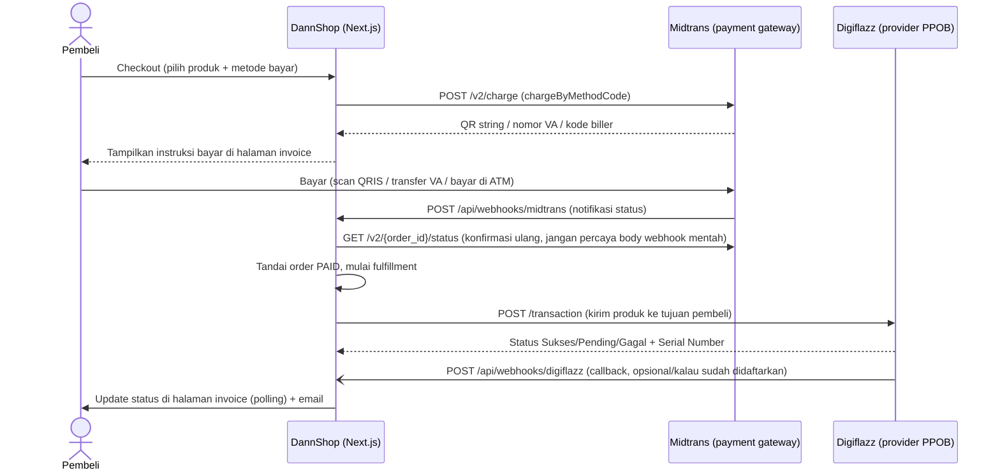

# 04 — Integrasi Payment Gateway & Provider PPOB

Dokumen ini menjelaskan dua integrasi eksternal yang jadi jantung bisnis DannShop:

1. **Midtrans** (payment gateway) — menerima uang dari pembeli.
2. **Digiflazz** (provider/supplier PPOB) — mengirim produk digital (diamond game, pulsa, dll.) ke tujuan pembeli.

> Semua path file di dokumen ini relatif dari root repo (`D:\Coding VSC\DannShop-PPOB`), dan aplikasi Next.js-nya ada di folder `web/`.

---

## 1. Ringkasan Arsitektur Integrasi

**Poin penting yang membedakan arsitektur ini dari asumsi umum:**
- **Midtrans yang dipakai adalah Core API, BUKAN Snap.** Tidak ada popup pembayaran sama sekali — semua instruksi bayar (kode QR, nomor VA, kode biller) dirender langsung di halaman invoice/deposit milik DannShop sendiri. (Proyek ini sempat pakai Snap, lalu dimigrasikan balik ke Core API supaya tidak tergantung iframe pihak ketiga — lihat riwayat commit kalau butuh detail historisnya.)
- **Digiflazz dipantau lewat DUA jalur sekaligus: polling (utama, selalu jalan) + webhook (pelengkap, opsional).** Job `recheck-fulfillment` (§3.5) SELALU dijadwalkan untuk tiap transaksi, apa pun kondisinya — ini jaring pengaman utama. Endpoint `POST /api/webhooks/digiflazz` (`web/src/app/api/webhooks/digiflazz/route.ts`) ADA dan aktif, tapi cuma benar-benar berguna (mempercepat update status jadi hampir instan, bukan menunggu siklus poll) kalau: (1) URL-nya didaftarkan manual di dashboard Digiflazz, DAN (2) "Webhook Secret" diisi sama persis di dua tempat — dashboard Digiflazz dan `/admin/providers` (field kredensial Digiflazz). **Kalau `webhookSecret` belum diisi, endpoint ini otomatis menolak SEMUA request (fail-closed)** — jadi aman dibiarkan apa adanya sampai siap dikonfigurasi, tidak akan pernah salah proses callback palsu.

---

## 2. Midtrans — Payment Gateway

### 2.1 File-file terkait

| File | Fungsi |
|---|---|
| `web/src/lib/midtrans/client.ts` | Semua fungsi pemanggil API Midtrans (`chargeQris`, `chargeBankTransfer`, `chargePermataVA`, `chargeEchannel`, `getTransactionStatus`, dan `chargeByMethodCode` sebagai dispatcher). |
| `web/src/lib/midtrans/signature.ts` | Verifikasi tanda tangan (signature) webhook Midtrans. |
| `web/src/lib/midtrans/status-mapping.ts` | Menerjemahkan status mentah Midtrans (`settlement`, `capture`, `pending`, `expire`, dll.) jadi status internal (`paid`/`pending`/`failed`/`expired`). |
| `web/src/app/api/webhooks/midtrans/route.ts` | Endpoint yang dipanggil Midtrans saat status pembayaran berubah. |
| `web/src/app/actions/checkout.ts` | Memicu `chargeByMethodCode` saat checkout produk. |
| `web/src/app/actions/deposit.ts` | Memicu `chargeByMethodCode` saat isi saldo. |

### 2.2 Kredensial

Cuma butuh 2 environment variable — **tidak** disimpan di database (beda dari Digiflazz, lihat §3.2):

| Env var | Fungsi |
|---|---|
| `MIDTRANS_SERVER_KEY` | Server key dari dashboard Midtrans (sandbox atau production). |
| `MIDTRANS_IS_PRODUCTION` | `"true"` untuk hit `api.midtrans.com`, apa pun selain itu (termasuk kosong) dianggap sandbox → `api.sandbox.midtrans.com`. |

### 2.3 Metode pembayaran yang didukung

`PaymentMethodConfig.code` di database menentukan metode mana yang aktif. Kode yang dikenali oleh `chargeByMethodCode` (`web/src/lib/midtrans/client.ts:289`):

| Code | Fungsi Midtrans dipanggil | `payment_type` Midtrans | Bentuk hasil ke pembeli |
|---|---|---|---|
| `qris` | `chargeQris` | `qris` | String QR (`qrString`), dirender jadi gambar QR di halaman invoice/deposit lewat library `qrcode` (server-side, lihat §2.5). |
| `va_bca`, `va_bni`, `va_bri`, `va_cimb` | `chargeBankTransfer` | `bank_transfer` + `bank_transfer.bank` | Nomor VA (`vaNumber`) + nama bank. |
| `va_permata` | `chargePermataVA` | `bank_transfer` (tanpa field `bank_transfer` — Midtrans otomatis mengartikannya sebagai Permata) | Nomor VA Permata. Response Midtrans-nya **beda schema** dari BCA/BNI/BRI/CIMB (field top-level `permata_va_number`, bukan array `va_numbers`). |
| `va_mandiri` | `chargeEchannel` | `echannel` (bukan `bank_transfer`!) | **Bukan nomor VA** — sepasang `billerCode` + `billKey` yang dimasukkan lewat ATM/e-banking (Mandiri Bill Payment). |

> **Kalau mau menambah metode pembayaran baru** (mis. metode bank lain yang Midtrans dukung), lihat panduan lengkap di `docs/05-CARA-TAMBAH-FITUR.md`.

### 2.4 `custom_expiry` — sinkronisasi waktu kedaluwarsa

Setiap panggilan charge menyertakan `custom_expiry: { expiry_duration: expiryMinutes, unit: "minute" }` (fungsi `customExpiry` di `client.ts:60`). Ini **wajib** ada — kalau tidak, Midtrans default-nya membuat VA/echannel valid ~24 jam, sementara job lokal (`expire-order`/`expire-deposit`, lihat `web/src/lib/jobs/runner.ts`) menandai order/deposit `EXPIRED` di menit ke-15. Tanpa sinkronisasi ini, pembeli bisa transfer ke VA yang di aplikasi sudah dianggap kedaluwarsa tapi di Midtrans masih hidup — uang masuk tapi tidak pernah diproses otomatis.

### 2.5 QRIS — kenapa harus di-generate ulang di server

`chargeQris` mengembalikan `qrString` (bukan gambar). DannShop men-generate gambar QR dari string itu **sendiri** di server (pakai library `qrcode`), bukan memanggil endpoint gambar pihak ketiga — ini keputusan keamanan (Content Security Policy) yang diambil di fase security-hardening proyek ini, jangan diubah balik ke layanan gambar eksternal tanpa alasan kuat.

### 2.6 Webhook Midtrans — `web/src/app/api/webhooks/midtrans/route.ts`

Alur verifikasi & pemrosesan (baca kode aslinya untuk detail lengkap, ringkasan urutannya):

1. **Cek `MIDTRANS_SERVER_KEY` ada** — kalau tidak ada di env, langsung 500.
2. **Batasi ukuran body** (maks 16.000 byte) — cegah payload raksasa.
3. **Parse & validasi bentuk JSON** (Zod schema `notifSchema`) — harus punya `order_id`, `status_code`, `gross_amount`, `signature_key`, `transaction_status`.
4. **Verifikasi signature** (`verifyMidtransSignature`) — **ini terjadi PALING AWAL**, sebelum baris apa pun disentuh di database. Signature = `SHA512(order_id + status_code + gross_amount + server_key)`, dibandingkan pakai `safeCompare` (timing-safe, lihat `web/src/lib/crypto.ts`) supaya tidak bisa ditebak lewat serangan timing.
5. **Idempotency check** lewat tabel `WebhookEvent` — `eventKey` = `` `midtrans:${order_id}:${transaction_status}` ``. Kalau event dengan key ini sudah pernah `processedAt`-nya terisi, langsung balas `{ deduped: true }` tanpa proses ulang (Midtrans memang bisa mengirim notifikasi yang sama berkali-kali).
6. **Konfirmasi ulang ke Midtrans** lewat `getTransactionStatus(order_id)` — **body webhook mentah TIDAK PERNAH langsung dipercaya** untuk memutuskan status akhir, selalu dicek ulang lewat API GET status. Ini mencegah pemalsuan notifikasi walau signature-nya entah bagaimana valid.
7. **Cocokkan `order_id` ke tabel `Order` atau `Deposit`** (Midtrans `order_id` dipakai dobel — untuk order pakai `Order.orderNumber`, untuk deposit pakai `Deposit.id` langsung, lihat §4).
8. **Cek nominal settlement cocok** dengan nominal yang seharusnya (`Order.total` atau `Deposit.totalPaid`) — kalau tidak cocok, order di-escalate ke `NEEDS_REVIEW` (admin harus tinjau manual), deposit **tidak dikredit sama sekali** dan admin dikirim alert Telegram.
9. **Update status** pakai `updateMany` dengan kondisi `where: { status: "PENDING_PAYMENT" }` (bukan `update` biasa) — ini "klaim atomik" supaya kalau webhook yang sama diproses dua proses bersamaan, cuma satu yang benar-benar berhasil mengubah status (mencegah fulfillment/kredit saldo dobel).

### 2.7 Status Mapping (`status-mapping.ts`)

| `transaction_status` Midtrans | `fraud_status` | Hasil (`mapMidtransStatus`) |
|---|---|---|
| `settlement` | — | `paid` |
| `capture` | `accept` | `paid` |
| `capture` | selain `accept` | `failed` |
| `pending` | — | `pending` |
| `expire` | — | `expired` |
| lainnya (`cancel`, `deny`, dll.) | — | `failed` |

---

## 3. Digiflazz — Provider PPOB

### 3.1 File-file terkait

| File | Fungsi |
|---|---|
| `web/src/lib/providers/digiflazz.ts` | `DigiflazzAdapter` class — implementasi konkret pemanggilan API Digiflazz. |
| `web/src/lib/providers/digiflazz-sign.ts` | Fungsi `digiflazzSign` (MD5 signature yang Digiflazz wajibkan di tiap request) + verifikasi signature callback. |
| `web/src/lib/providers/types.ts` | Interface `TopupProviderAdapter` — kontrak yang wajib dipenuhi provider mana pun (termasuk provider baru di masa depan seperti OkeConnect/QiosPay/Serpul yang statusnya baru terdaftar di `enum ProviderKey` tapi **belum ada adapter-nya**, lihat `web/src/lib/providers/registry.ts:36-37`). |
| `web/src/lib/providers/registry.ts` | `getAdapter(key)` — factory yang mengambil kredensial dari DB, mendekripsinya, lalu membuat instance adapter yang sesuai. |
| `web/src/lib/catalog/price-sync.ts` | Sinkronisasi daftar harga produk dari Digiflazz ke cache lokal (`ProviderPriceListCache`). |
| `web/src/lib/order/fulfillment.ts` | Logika inti "pilih SKU lalu kirim transaksi ke provider" + penanganan hasil sukses/gagal. |
| `web/src/lib/jobs/runner.ts` (handler `recheck-fulfillment`) | Polling status transaksi yang masih pending. |
| `web/src/app/api/webhooks/digiflazz/route.ts` | Endpoint callback Digiflazz — opsional, lihat §3.7. |

### 3.2 Kredensial — terenkripsi di database, BUKAN env var

Beda dari Midtrans, kredensial Digiflazz (`username`, `apiKey`, `webhookSecret` opsional) disimpan **di database** (tabel `ProviderConfig`, kolom `credentials`), **dienkripsi** (AES-256-GCM) sebelum disimpan lewat `encryptJson`/`decryptJson` (`web/src/lib/crypto.ts`). Diisi lewat halaman admin `/admin/providers`, bukan file `.env`. Kunci enkripsinya sendiri **ada** di env var:

| Env var | Fungsi |
|---|---|
| `CREDENTIALS_ENCRYPTION_KEY` | Kunci AES 256-bit (64 karakter hex) untuk mengenkripsi/mendekripsi SEMUA kredensial provider yang tersimpan di DB (juga dipakai untuk kredensial email Resend/SMTP, lihat `docs/06-TROUBLESHOOTING-DEPLOY.md`). Generate dengan `openssl rand -hex 32`. |

### 3.3 Signature Digiflazz

Setiap request ke Digiflazz wajib menyertakan `sign` — MD5 dari kombinasi `username + apiKey + <sesuatu>`, di mana `<sesuatu>` beda tergantung endpoint:
- Cek harga (`/price-list`): MD5(`username + apiKey + "pricelist"`)
- Cek saldo (`/cek-saldo`): MD5(`username + apiKey + "depo"`)
- Buat transaksi (`/transaction`): MD5(`username + apiKey + ref_id`) — `ref_id` unik per transaksi (lihat `web/src/lib/order/order-number.ts` fungsi `generateRefId`).

Lihat implementasi persisnya di `web/src/lib/providers/digiflazz-sign.ts`.

### 3.4 Alur pengiriman produk (`dispatchFulfillment`)

Dipanggil dari webhook Midtrans (setelah order jadi `PAID`) atau langsung setelah bayar-pakai-saldo berhasil. Ringkasan (`web/src/lib/order/fulfillment.ts`):

1. **Klaim atomik** — `updateMany` order dari status `PAID` → `PROCESSING`. Kalau order sudah bukan `PAID` (mis. sedang diproses proses lain), fungsi berhenti di sini (mencegah pengiriman dobel).
2. **Pilih SKU provider** (`selectFulfillmentSku`, `web/src/lib/order/select-provider.ts`) — cari `ProviderSku` DIGIFLAZZ yang statusnya `ACTIVE`, provider-nya aktif (bukan di-nonaktifkan admin lewat kill-switch), dan `costPrice`-nya **tidak melebihi** harga jual (kalau harga modal naik di atas harga jual sejak terakhir sinkron, order **tidak** dikirim — dieskalasi ke `NEEDS_REVIEW` supaya tidak jual rugi diam-diam).
3. **Jadwalkan job pengaman `recheck-fulfillment`** (jalan 60 detik lagi) **SEBELUM** memanggil Digiflazz — supaya kalau panggilan API-nya gagal/timeout, tetap ada job yang akan mengecek ulang statusnya nanti, order tidak macet permanen.
4. **Panggil `adapter.createTransaction()`** — kirim `buyer_sku_code`, `customer_no` (hasil `buildCustomerNo`, gabungan semua `target` field sesuai urutan `inputFields` produk, mis. User ID + Zone ID digabung), dan `ref_id` unik.
5. **Terapkan hasilnya** (`applyFulfillmentResult`):
   - **Sukses** → order jadi `COMPLETED`, kirim email "Pesanan Berhasil" berisi Serial Number.
   - **Gagal** → kalau pembeli member (punya `userId`), saldo **otomatis dikembalikan ke wallet** (transaksi atomik + entri `WalletLedger`). Kalau pembeli tamu (guest, tanpa akun), order masuk antrean `REFUND_PENDING` untuk diproses admin manual.
   - **Pending** → tidak dilakukan apa-apa di sini, ditangani job `recheck-fulfillment`.

### 3.5 Polling status (jalur utama, SELALU aktif)

Job `recheck-fulfillment` (`web/src/lib/jobs/runner.ts:173`) berjalan berulang (dijadwalkan ulang tiap kali masih `pending`, sampai maksimal 30 kali percobaan) memanggil `adapter.checkStatus()` — yang pada `DigiflazzAdapter`, **sama persis** dengan memanggil `createTransaction()` lagi (Digiflazz memang dirancang begitu: memanggil endpoint transaksi yang sama dengan `ref_id` yang sama akan mengembalikan status transaksi tersebut, bukan membuat transaksi baru). Setelah 30 kali masih pending, order dieskalasi ke `NEEDS_REVIEW` untuk ditinjau admin. **Job ini dijadwalkan untuk SETIAP transaksi tanpa syarat** (§3.4 langkah 3) — tetap jalan walau webhook (§3.7) sudah dikonfigurasi, jadi order tidak akan pernah macet permanen hanya karena satu callback webhook gagal terkirim.

### 3.6 Sinkronisasi harga (`price-sync.ts` + halaman `/admin/providers`)

Job `sync-prices` (self-reschedule tiap 3 jam) memanggil `adapter.fetchPriceList()` untuk menarik SELURUH daftar harga Digiflazz ke tabel cache `ProviderPriceListCache` — ini **bukan** daftar SKU yang sudah dipetakan admin (`ProviderSku`), melainkan katalog mentah lengkap, dipakai untuk pencarian cepat di halaman "Petakan SKU"/"Import Massal" tanpa harus hit API Digiflazz tiap kali admin mengetik (menghindari rate limit Digiflazz).

### 3.7 Webhook Digiflazz (jalur pelengkap, opsional)

`POST /api/webhooks/digiflazz` (`web/src/app/api/webhooks/digiflazz/route.ts`) — mempercepat update status jadi hampir instan begitu Digiflazz selesai memproses, alih-alih menunggu siklus poll berikutnya (bisa sampai puluhan detik). Pola kerjanya identik dengan webhook Midtrans (§2.6): verifikasi signature dulu sebelum sentuh database, idempotent lewat `WebhookEvent` (`source: "digiflazz"`), lalu memanggil `applyFulfillmentResult()` — **fungsi yang SAMA PERSIS** dipakai job polling, jadi hasil akhirnya selalu konsisten dari jalur mana pun datangnya.

**Cara mengaktifkan (2 langkah di luar kode, harus dilakukan admin secara manual):**
1. Isi field "Webhook Secret" di form kredensial Digiflazz (`/admin/providers`).
2. Daftarkan URL `https://<domain-produksi>/api/webhooks/digiflazz` di dashboard/pengaturan akun Digiflazz, pakai **secret yang sama persis** dengan langkah 1.

**Kalau belum sempat/belum mau dikonfigurasi:** dibiarkan saja, tidak masalah — endpoint ini otomatis menolak (403) semua request selama `webhookSecret` masih kosong (`DigiflazzAdapter.parseCallback` selalu mengembalikan `verified: false` kalau tidak ada secret untuk dibandingkan), dan aplikasi tetap berfungsi normal sepenuhnya lewat polling saja (§3.5).

---

## 4. Alur Transaksi Lengkap — Checkout Produk (Step-by-Step)

1. **Pembeli isi form checkout** (`web/src/app/(public)/[categorySlug]/[productSlug]/product-detail-client.tsx`) → submit ke server action `createCheckoutOrder` (`web/src/app/actions/checkout.ts`).
2. **Server menghitung harga final** lewat `effectivePrice()` (`web/src/lib/pricing/effective-price.ts`) — prioritas: harga flash sale (kalau sedang aktif) > harga member (kalau login) > harga normal. **Harga yang dikirim dari browser TIDAK PERNAH dipercaya**, semua dihitung ulang di server dari data `ProductItem` di database.
3. **Cek ketersediaan** lewat `selectFulfillmentSku` — pastikan ada SKU Digiflazz aktif dengan harga modal yang masih masuk akal.
4. **Dua jalur pembayaran:**
   - **Bayar saldo** (`createBalanceOrder`) — langsung potong `Wallet.balance` dalam satu transaksi database, order langsung `PAID`, langsung panggil `dispatchFulfillment`.
   - **Bayar Midtrans** (`createMidtransOrder`) — hitung fee + kode unik (`web/src/lib/payment/fee.ts`), panggil `chargeByMethodCode`, simpan hasilnya (`actions` — QR string/nomor VA/kode biller) ke `OrderPayment.actions`, jadwalkan job `expire-order`.
5. **Order dibuat** dengan status `PENDING_PAYMENT` (Midtrans) atau langsung `PAID` (saldo).
6. **Pembeli diarahkan ke `/invoice/[token]`** — halaman ini polling `/api/orders/[token]/status` tiap 3 detik (lewat `@tanstack/react-query`) untuk menampilkan status terkini tanpa refresh manual.
7. **(Jalur Midtrans) Pembeli bayar** → Midtrans kirim webhook → alur §2.6 di atas → order jadi `PAID` → `dispatchFulfillment` dipanggil.
8. **Fulfillment ke Digiflazz** → alur §3.4 di atas.
9. **Order selesai** (`COMPLETED`, dengan Serial Number) atau **gagal & di-refund** (`REFUNDED`/`REFUND_PENDING`) — pembeli melihat hasil akhirnya secara real-time di halaman invoice yang sama, dan (kalau alamat email diisi & sistem email sudah dikonfigurasi admin) menerima email juga.

**Alur isi saldo (deposit)** hampir identik, tapi lebih sederhana karena tidak ada langkah fulfillment ke Digiflazz — begitu Midtrans konfirmasi `paid`, `Wallet.balance` langsung ditambah (lihat `handleDepositWebhook` di `web/src/app/api/webhooks/midtrans/route.ts`).

---

## 5. Environment Variables — Ringkasan Integrasi Ini

> Nilai asli TIDAK dicantumkan di sini — isi contoh format lengkap ada di `web/.env.example`.

| Env var | Untuk integrasi | Wajib? |
|---|---|---|
| `MIDTRANS_SERVER_KEY` | Midtrans — autentikasi semua panggilan API | Wajib |
| `MIDTRANS_IS_PRODUCTION` | Midtrans — pilih sandbox vs production | Wajib (`"true"`/`"false"`) |
| `CREDENTIALS_ENCRYPTION_KEY` | Digiflazz (dan provider PPOB lain di masa depan) — kunci enkripsi kredensial yang disimpan di DB | Wajib |
| `CRON_SECRET` | Melindungi endpoint `/api/cron/tick` yang memicu job `recheck-fulfillment`/`sync-prices`/dll. — lihat `docs/06-TROUBLESHOOTING-DEPLOY.md` | Wajib |
| `NEXT_PUBLIC_APP_URL` | Dipakai membangun link invoice di email notifikasi | Wajib |

Kredensial Digiflazz sendiri (`username`, `apiKey`, `webhookSecret`) **bukan** environment variable — diisi lewat UI admin di `/admin/providers` (lihat §3.2).

---

## Cheat Sheet — Integrasi Payment & PPOB

| Saya mau... | Baca/edit file ini |
|---|---|
| Menambah metode pembayaran Midtrans baru (mis. bank lain) | `web/src/lib/midtrans/client.ts` (`chargeByMethodCode`) — lihat `docs/05-CARA-TAMBAH-FITUR.md` |
| Ganti server key Midtrans / pindah ke mode production | Env var `MIDTRANS_SERVER_KEY`, `MIDTRANS_IS_PRODUCTION` di Vercel |
| Lihat/edit kredensial Digiflazz | `/admin/providers` (UI), disimpan lewat `web/src/app/actions/providers.ts` |
| Ganti kunci enkripsi kredensial | Env var `CREDENTIALS_ENCRYPTION_KEY` — **hati-hati**, mengganti ini bikin semua kredensial lama tidak bisa didekripsi lagi |
| Debug kenapa notifikasi Midtrans tidak masuk | Cek `/admin/webhooks` (log semua `WebhookEvent`), lalu `web/src/app/api/webhooks/midtrans/route.ts` |
| Aktifkan webhook Digiflazz (biar status update instan, bukan cuma polling) | Isi "Webhook Secret" di `/admin/providers` + daftarkan URL-nya di dashboard Digiflazz — lihat §3.7 |
| Debug kenapa order macet di `PROCESSING` | Cek `/admin/jobs` (status job `recheck-fulfillment`), lalu `web/src/lib/order/fulfillment.ts` |
| Ubah durasi kedaluwarsa pembayaran (sekarang 15 menit) | `EXPIRY_MINUTES` di `web/src/app/actions/checkout.ts` DAN `web/src/app/actions/deposit.ts` (dua tempat, harus sama) |
| Menambah provider PPOB baru (selain Digiflazz) | Buat class baru implement `TopupProviderAdapter` (`web/src/lib/providers/types.ts`), daftarkan di `web/src/lib/providers/registry.ts` — lihat `docs/05-CARA-TAMBAH-FITUR.md` |
| Lihat fungsi hitung fee & kode unik | `web/src/lib/payment/fee.ts` |
| Lihat aturan harga efektif (flash sale/member/normal) | `web/src/lib/pricing/effective-price.ts` |
